# Video Automation Server – Documentation (YouTube + Instagram)

## Table of Contents

- [Authentication](#authentication)
- [API Endpoints](#api-endpoints)
  - [Health](#health)
  - [API Schema](#api-schema)
  - [Channels](#channels)
  - [Videos](#videos)
  - [Categories](#categories)
  - [Analysis](#analysis)
- [Database Schema](#database-schema)
  - [channels](#collection-channels)
  - [content_params](#collection-content_params)
  - [videos](#collection-videos)
  - [posting_queue (Ready Queue)](#collection-posting_queue-ready-queue)
  - [schedule_queue (Scheduled Queue)](#collection-schedule_queue-scheduled-queue)
  - [categories](#collection-categories)
  - [analysis](#collection-analysis)
  - [analysis_history](#collection-analysis_history)
  - [comment_analysis](#collection-comment_analysis)
  - [retention_analysis](#collection-retention_analysis)
- [Services Architecture](#services-architecture)
- [Comment Analysis System](#comment-analysis-system)
- [Retention Analysis System](#retention-analysis-system)
- [Data Flow Diagrams](#data-flow-diagrams)
  - [Video Status Lifecycle](#video-status-lifecycle)
  - [System Architecture](#system-architecture)
  - [Video Upload and Schedule Flow](#video-upload-and-schedule-flow)
  - [Sync Flow](#sync-flow)
  - [Analysis Flow](#analysis-flow)
  - [To-do Video Generation Flow](#to-do-video-generation-flow)
  - [Content Params Extraction Flow](#content-params-extraction-flow)
  - [Scheduling Slot Computation](#scheduling-slot-computation)

---

## Authentication

**All endpoints** (except `/health`) require an API key passed in the `X-API-Key` header.

```
X-API-Key: your-secret-key
```

- The key is validated against the `API_KEY` value in `.env`.
- Invalid or missing keys return `401 Unauthorized`.

---

## Timezone Convention

**All timestamps** throughout the system use **IST (GMT+5:30)** — both in the code and in the database.

- A central helper `now_ist()` (in `app/timezone.py`) returns the current timezone-aware IST datetime.
- All model `default_factory` values, all `created_at` / `updated_at` / `published_at` / `scheduled_at` / `added_at` fields use IST.
- YouTube API publish dates are converted to IST before storage.
- The scheduling engine uses `Asia/Kolkata` (equivalent to GMT+5:30) for computing publish slots.

---

## API Endpoints

Base URL: `http://localhost:8000`

All channel-scoped endpoints are prefixed with `/api/v1/channels/{channel_id}/` where `channel_id` is the internal slug for the channel (e.g. `tech-tips`).

---

### Health

#### `GET /health`

Simple liveness check. No authentication required.

**Response:**

```json
{ "status": "ok" }
```

---

### API Schema

#### `GET /api/schema`

Returns the full API schema with method, path, description, request body, query params, and example response for every endpoint. Useful for building clients, documentation, or AI integrations. No authentication required.

**Response:**

```json
{
  "service": "YouTube Automation Server",
  "version": "1.0.0",
  "auth": { "header": "X-API-Key", "required_for": "/api/v1/*" },
  "endpoints": [
    {
      "group": "Videos",
      "method": "GET",
      "path": "/api/v1/channels/{channel_id}/videos/",
      "description": "List videos with sync status",
      "query_params": {
        "status_filter": {
          "type": "string",
          "enum": ["todo", "ready", "scheduled", "published"],
          "optional": true
        }
      },
      "request": null,
      "response": { "videos": ["..."], "sync_status": { "...": "..." } }
    }
  ]
}
```

---

### Channels

Prefix: `/api/v1/channels`

Manages channel registration for **YouTube** and **Instagram**. Channel data is **auto-fetched from the respective platform** on registration. Each platform gets its own channel entry — the same brand can have separate YouTube and Instagram channels (e.g. `officialgeoranking` for YouTube and `officialgeoranking-ig` for Instagram), each with independent categories, analysis, and content params.

---

#### `POST /` — Register a new channel

Creates a channel by fetching its data from the appropriate platform API.

**Request body (YouTube):**

```json
{
  "platform": "youtube",
  "youtube_channel_id": "UCxxxxxxxx",
  "channel_id": "my-channel"
}
```

**Request body (Instagram):**

```json
{
  "platform": "instagram",
  "instagram_user_id": "17841400123456789",
  "channel_id": "my-channel-ig"
}
```

- `platform` — `"youtube"` (default) or `"instagram"`
- `youtube_channel_id` — required for YouTube
- `instagram_user_id` — required for Instagram (the Instagram Graph API user ID)
- `channel_id` — optional custom slug. Auto-generated if omitted (YouTube: from custom URL; Instagram: from username + `-ig` suffix)

**What happens:**

1. Server calls the platform API (YouTube Data API or Instagram Graph API) to fetch account metadata (name, description, subscriber/follower count, video/media count, thumbnail).
2. If `channel_id` is not provided, one is auto-generated.
3. All data is stored in the `channels` collection with the `platform` field set.

**Response (201):**

```json
{
  "_id": "65f...",
  "channel_id": "tech-tips",
  "youtube_channel_id": "UCxxxxxxxx",
  "name": "Tech Tips Daily",
  "description": "Daily tech tutorials and reviews...",
  "custom_url": "@techtips",
  "thumbnail_url": "https://yt3.ggpht.com/...",
  "subscriber_count": 125000,
  "video_count": 342,
  "view_count": 15000000,
  "created_at": "2024-01-15T10:30:00Z",
  "updated_at": "2024-01-15T10:30:00Z"
}
```

**Errors:**

- `404` — YouTube channel ID not found on YouTube
- `409` — Channel with that `channel_id` already exists
- `503` — YouTube service not initialised

---

#### `GET /` — List all channels

Returns all registered channels.

**Response (200):**

```json
[
  {
    "_id": "65f...",
    "channel_id": "tech-tips",
    "name": "Tech Tips Daily",
    "subscriber_count": 125000,
    ...
  }
]
```

---

#### `GET /{channel_id}` — Get a single channel

**Path params:** `channel_id` — internal slug

**Response (200):** Full channel document.

**Errors:** `404` — Channel not found.

---

#### Content Params — CRUD endpoints

Content param definitions are stored in the `content_params` collection (not on the channel document). Each param defines a custom dimension (e.g. `video_topic`, `ranking_factor`, `music`) that videos are tagged with.

---

#### `GET /{channel_id}/content-params` — List all content params for channel

Returns all content param definitions for the channel.

**Response (200):**

```json
[
  {
    "channel_id": "officialgeoranking",
    "name": "video_topic",
    "description": "The thing that the video is ranking",
    "values": [
      { "value": "GDP", "score": 85, "video_count": 4 },
      { "value": "Population", "score": 72, "video_count": 6 }
    ],
    "belongs_to": ["all"],
    "unique": true,
    "created_at": "2024-01-15T10:30:00Z",
    "updated_at": "2024-01-15T10:30:00Z"
  }
]
```

- `values` — for params with predefined options: array of `{value, score, video_count}`; scores and video_count are updated after channel summary analysis. If an analysed video uses a value not yet tracked, it is auto-added. Free-form params have `values: []`.
- `belongs_to` — array of category names this param applies to; default `["all"]` means it applies to all categories. User can scope to specific categories.
- `unique` — if `true`, the TODO generator tells Gemini not to reuse already-used values for this param when generating new video ideas. Useful for free-form params like `video_topic` where each video should cover a distinct topic. Default `false`.

---

#### `POST /{channel_id}/content-params` — Add a new content param

**Request body:**

```json
{
  "name": "video_topic",
  "description": "The thing that the video is ranking",
  "values": [],
  "belongs_to": ["all"],
  "unique": true
}
```

- `name` — parameter key used in `content_params` on videos (required)
- `description` — what this parameter represents (optional)
- `values` — for predefined options: array of `{value, score?, video_count?}`; empty list means free-form (Gemini infers)
- `belongs_to` — array of category names; default `["all"]`
- `unique` — if `true`, the TODO generator tells Gemini not to reuse already-used values for this param (default `false`)

**Response (201):** `{"ok": true, "channel_id": "...", "param": {...}}`

---

#### `PUT /{channel_id}/content-params/{param_name}` — Update a content param

Updates `description`, `values`, `belongs_to`, and/or `unique` for an existing param.

**Path params:** `param_name` — the param's `name` field

**Request body (all fields optional):**

```json
{
  "description": "Updated description",
  "values": [{ "value": "GDP", "score": 85, "video_count": 4 }],
  "belongs_to": ["Geography", "Economics"],
  "unique": true
}
```

**Response (200):** `{"ok": true, "channel_id": "...", "param": {...}}`

---

#### `DELETE /{channel_id}/content-params/{param_name}` — Delete a content param

Removes the content param definition. Existing videos may still have that key in `content_params` until you run **`POST /{channel_id}/content-params/sync`** to strip orphaned keys.

**Path params:** `param_name` — the param's `name` field

**Response (200):** `{"ok": true, "channel_id": "...", "deleted": true}`

---

#### `POST /{channel_id}/content-params/sync` — Strip orphaned keys from videos

For every video on the channel with `content_params` set, keeps only keys that still exist in the `content_params` collection. If no keys remain, sets `content_params` to `null`. Call this after deleting or renaming param definitions so stored video metadata matches the current schema.

**Response (200):**

```json
{
  "ok": true,
  "channel_id": "my_channel",
  "valid_param_names": ["simulation_type", "challenge_mechanic"],
  "videos_scanned": 120,
  "videos_updated": 15,
  "orphan_keys_removed": 18
}
```

---

#### `POST /{channel_id}/refresh` — Re-fetch data from platform

Pulls the latest stats (subscriber/follower count, video count, etc.) from the appropriate platform (YouTube or Instagram) and updates the DB.

**Response (200):**

```json
{
  "ok": true,
  "channel_id": "tech-tips",
  "updated": {
    "name": "Tech Tips Daily",
    "subscriber_count": 126000,
    "video_count": 345,
    ...
  }
}
```

---

#### `PATCH /{channel_id}` — Update a channel

Partially update channel fields.

**Request body:**

```json
{
  "name": "New Channel Name" // optional
}
```

**Response (200):** `{"ok": true, "channel_id": "tech-tips"}`

---

- **Endpoint**: `/api/v1/channels/{channel_id}`
- **Method**: `DELETE`
- **Description**: Removes channel and ALL associated data (videos, categories, analysis, queues).
- **Cleanup**: It automatically iterates through all videos and deletes their associated `.mp4` files from Cloudflare R2 storage before removing the database records.

**Response (200):** `{"ok": true, "channel_id": "tech-tips", "deleted": true}`

---

#### Competitors

Manage competitor YouTube channels tracked for each channel. Stored in the `competitors` collection.

---

#### `GET /{channel_id}/competitors` — List competitors

Returns all competitors for a channel.

**Response (200):**

```json
{
  "channel_id": "physicsasmr_official",
  "competitors": [
    {
      "channel_id": "physicsasmr_official",
      "youtube_channel_id": "UC...",
      "handle": "@SomeCreator",
      "name": "Some Creator",
      "thumbnail": "https://...",
      "created_at": "2026-03-07T12:00:00+05:30"
    }
  ]
}
```

---

#### `POST /{channel_id}/competitors` — Add a competitor

Adds a competitor channel. Returns 409 if the competitor already exists for this channel.

**Request body:**

```json
{
  "youtube_channel_id": "UC...",
  "handle": "@SomeCreator",
  "name": "Some Creator",
  "thumbnail": "https://..."
}
```

**Response (201):** The created competitor document.

---

#### `DELETE /{channel_id}/competitors/{youtube_channel_id}` — Remove a competitor

Removes a competitor from the channel. Returns 404 if not found.

**Response (200):** `{"ok": true, "deleted": "UC..."}`

---

### Videos

Prefix: `/api/v1/channels/{channel_id}/videos`

Manages the video list — both manually created to-do items and AI-generated suggestions.

---

#### `GET /` — List videos

Returns all videos for a channel, with optional filtering and suggestion marking.

**Query params:**

| Param                   | Type   | Default | Description                                                                                           |
| ----------------------- | ------ | ------- | ----------------------------------------------------------------------------------------------------- |
| `status_filter`         | string | `all`   | Filter by status: `todo`, `ready`, `scheduled`, `published`, or `all`                                 |
| `verification_status` | string | —       | Filter by verification status: `unverified`, `verified`, or `missing`                                  |
| `suggest_n`             | int    | —       | If provided, marks the top N to-do videos as `suggested=true` (ordered by category score, best first) |

**How `suggest_n` works:**

1. Resets all previously suggested videos (`suggested=false`)
2. Fetches active categories sorted by score (highest first)
3. Sorts to-do videos by their category's score
4. Marks the top N as `suggested=true`
5. Returns the full video list

**Response (200):**

The response is a wrapper with `videos` (the array) and `sync_status` (how many videos need syncing).

```json
{
  "videos": [
    {
      "channel_id": "tech-tips",
      "video_id": "550e8400-e29b-41d4-a716-446655440000",
      "title": "10 VS Code Tricks You Didn't Know",
      "description": "In this video...",
      "tags": ["vscode", "productivity", "coding"],
      "category": "Tutorials",
      "status": "todo",
      "suggested": true,
      "youtube_video_id": null,
      "r2_object_key": null,
      "metadata": {
        "views": null,
        "likes": null,
        "comments": null,
        "duration_seconds": null,
        "engagement_rate": null,
        "like_rate": null,
        "comment_rate": null,
        "avg_percentage_viewed": null,
        "avg_view_duration_seconds": null,
        "estimated_minutes_watched": null
      },
      "scheduled_at": null,
      "published_at": null,
      "created_at": "2024-01-15T10:30:00Z",
      "updated_at": "2024-01-15T10:30:00Z"
    }
  ],
  "sync_status": {
    "available": true,
    "youtube_total": 60,
    "in_database": 55,
    "new_videos_to_import": 5,
    "pending_reconciliation": 2,
    "metadata_to_refresh": 55
  }
}
```

`sync_status` fields (YouTube channels):

- `youtube_total` — total videos on the YouTube channel
- `in_database` — videos in our DB that have a `youtube_video_id`
- `new_videos_to_import` — videos on YouTube not yet in the DB
- `pending_reconciliation` — videos in `scheduled` status whose YouTube video is actually live (public) on YouTube (reconciled to `published` on next sync)
- `metadata_to_refresh` — existing videos whose stats will be refreshed on next sync

`sync_status` fields (Instagram channels):

- `instagram_total` — total reels on the Instagram account
- `in_database` — reels in our DB that have an `instagram_media_id`
- `new_reels_to_import` — reels on Instagram not yet in the DB
- `metadata_to_refresh` — existing reels whose metrics will be refreshed on next sync

---

#### `POST /sync` — Sync videos from platform

Fetches all videos/reels from the channel's platform, finds any not already in the DB, categorizes them via Gemini (auto-creating categories from the channel description), and inserts them as `published`. Auto-detects whether the channel is YouTube or Instagram.

**Optional request body:**

```json
{
  "new_category_description": "Extra instructions for Gemini on how to categorize"
}
```

**What happens:**

1. Fetches all videos from the channel's uploads playlist (paginated) — pulls `snippet`, `statistics`, `contentDetails` (duration), and `status` (privacyStatus, publishAt)
2. Enriches with YouTube Analytics API data (`avg_percentage_viewed`, `avg_view_duration_seconds`, `estimated_minutes_watched`) when available
3. **Refreshes metadata** for all existing published videos in the DB — updates views, likes, comments, engagement rates, analytics, etc. with the latest data from YouTube
4. **Reconciles scheduled videos** — finds all videos in the DB with status `scheduled` and checks YouTube to see if they are actually live (privacy status is `public`). If live, marks them as `published`, sets `published_at` from YouTube's publish time, and cleans up their `schedule_queue` entry
5. Skips any already in the `videos` collection (by `youtube_video_id`)
6. **Extracts content params AND derives category** for new videos in batches of 5 via Gemini.
7. Auto-creates categories and **updates video counts** for all newly imported/reconciled videos.
8. **Detects scheduled videos** — if a video has `status.publishAt` set to a future time, it is inserted as `scheduled` (not `published`) with `scheduled_at` set to that time, and an entry is added to the `schedule_queue`. This correctly recognises videos that were uploaded to YouTube with a future publish time.
9. Remaining videos are inserted as `published` with full metadata.
10. **Processes unverified videos** — finds any existing videos in the DB with `verification_status: "unverified"` and `content_params: null` (e.g. ad-hoc uploads via `POST /create`), runs them through Gemini extraction to derive their category and content parameters.

**Response (200):**

```json
{
  "ok": true,
  "synced": 15,
  "synced_published": 14,
  "synced_scheduled": 1,
  "reconciled": 0,
  "metadata_refreshed": 30,
  ...
}
```

---

#### `DELETE /{video_id}` — Delete a video

Permanently remove a video and its assets.

**What happens:**

1. Deletes `.mp4` from R2.
2. Decrements category `video_count` if the video was published.
3. Removes from `posting_queue` and `schedule_queue`.
4. Deletes video document and `analysis_history` records.

**Response (200):** `{"ok": true, "video_id": "...", "deleted": true}`

---

#### `PATCH /{video_id}/status` — Update video status

Changes a video's status.

**Path params:** `video_id` — the UUID of the video

**Request body:**

```json
{
  "status": "published" // "todo", "ready", "scheduled", or "published"
}
```

**Side effects:**

- **Automatic Cleanup**: If moving FROM `ready` TO any other status, the video's `.mp4` file is deleted from R2 and it's removed from the `posting_queue`.
- **Category Counts**: When marking as `published`, the category's `video_count` is incremented. If moving AWAY from `published`, the count is decremented.
- **Timestamps**: When marking as `published`, `published_at` is set. When moving to `todo`, `scheduled_at` is cleared.
- **Scheduled Queue**: If moving away from `scheduled`, the entry is removed from the `schedule_queue`.

**Response (200):**

```json
{ "ok": true, "video_id": "550e8400-...", "status": "done" }
```

---

#### `PATCH /{video_id}/category` — Change video category

Moves a video from one category to another. Updates the video document, the per-video record in `analysis_history`, and recomputes metadata, `video_count`, and `video_ids` for both the old and new category.

**Path params:** `video_id` — the UUID of the video

**Request body:**

```json
{
  "old_category_id": "a1b2c3d4-...",
  "new_category_id": "e5f67890-..."
}
```

**Response (200):**

```json
{
  "ok": true,
  "video_id": "550e8400-...",
  "old_category": "Tutorials",
  "new_category": "Reviews"
}
```

---

#### `POST /{video_id}/extract-params` — Extract content params via Gemini

Uses Gemini to extract content parameter values from a video's title, description, and tags, based on the channel's content params (from the `content_params` collection). Results are saved with `verification_status: "unverified"`.

**Preconditions:** Channel must have at least one content param defined in the `content_params` collection.

**Response (200):**

```json
{
  "ok": true,
  "video_id": "550e8400-...",
  "content_params": {
    "simulation_type": "battle",
    "challenge_mechanic": "1v1",
    "music": "Epic Orchestral - Two Steps From Hell"
  },
  "verification_status": "unverified"
}
```

---

#### `POST /extract-params/all` — Bulk extract params for all videos

Extracts content parameters for every video in the channel that doesn't have them yet. Runs Gemini extraction one video at a time.

**Response (200):**

```json
{
  "ok": true,
  "extracted": 42,
  "total": 45
}
```

---

#### `POST /{video_id}/verify-params` — Verify video (category + content params)

Marks a video as `"verified"`. Optionally pass corrected `category` and/or `content_params` in the body to override AI-assigned values.

**Request body (optional):**

```json
{
  "category": "battle",
  "content_params": {
    "simulation_type": "survival",
    "challenge_mechanic": "tournament",
    "music": "Dramatic Piano - Ludovico Einaudi"
  }
}
```

**Response (200):**

```json
{
  "ok": true,
  "video_id": "550e8400-...",
  "category": "battle",
  "content_params": { "..." },
  "verification_status": "verified"
}
```

---

#### `POST /{video_id}/upload` — Upload video file

Uploads a video file for an existing `todo` video, streams it to Cloudflare R2, sets status to `ready`, and adds it to the ready queue.

**Request:** `multipart/form-data`

| Field  | Type          | Description                |
| ------ | ------------- | -------------------------- |
| `file` | File (binary) | The video file (.mp4)      |
| `body` | JSON string   | Video metadata (see below) |

**Body JSON:**

```json
{
  "title": "My Video Title", // required
  "description": "Description...", // optional
  "tags": ["tag1", "tag2"], // optional
  "category": "Tutorials" // optional
}
```

**What happens:**

1. Verifies the video exists and is in `todo` status
2. Streams the file to R2 at `{channel_id}/{video_id}.mp4`
3. Updates the video document: status → `ready`, sets `r2_object_key`
4. Creates an entry in the ready queue with the next available position

**Response (201):**

```json
{
  "ok": true,
  "video": { ...full video document... },
  "queue_position": 3
}
```

---

#### `POST /create` — Create ad-hoc video

Creates an unplanned video directly in `ready` status, uploads the file to R2, and adds it to the posting queue. Bypasses the `todo` stage entirely.

**Request:** `multipart/form-data`

| Field            | Type          | Required | Description                                               |
| ---------------- | ------------- | -------- | --------------------------------------------------------- |
| `file`           | File (binary) | Yes      | The video file                                            |
| `title`          | string        | Yes      | Video title                                               |
| `description`    | string        | No       | Video description (default `""`)                          |
| `tags`           | string        | No       | Comma-separated or JSON array (default `[]`)              |
| `category`       | string        | No       | Category name (default `"Uncategorized"`)                 |
| `content_params` | JSON string   | No       | Key-value content parameters                              |
| `scheduled_at`   | ISO 8601      | No       | [Instagram Only] If provided, creates as `scheduled`      |

**Verification logic:**

- If both `category` and `content_params` are provided \u2192 `verification_status: \"verified\"`
- Otherwise \u2192 `verification_status: \"unverified\"`, `category: \"Uncategorized\"`, `content_params: null`. The next sync will run Gemini extraction on it.

**Scheduling logic (Instagram only):**

- If `scheduled_at` is provided, the video is inserted with `status: \"scheduled\"` and added to the `schedule_queue`.
- Otherwise, it is inserted with `status: \"ready\"` and added to the `posting_queue`.

**Response (201):**

```json
{
  "ok": true,
  "video": { "...full video document..." },
  "queue_position": 3
}
```

---

#### `POST /{video_id}/schedule` — Schedule ready video(s)

Schedules video(s) on the channel's platform. Auto-detects whether the channel is YouTube or Instagram.

**Path params:** `video_id` — the UUID of a single video **OR** `"all"` to schedule every video in the ready queue.

**Request Body (Optional, for single video_id only):**

```json
{
  "scheduled_at": "2026-03-10T14:30:00+05:30"
}
```

**Preconditions:**

- The video(s) must be in `ready` status (uploaded to R2). Returns `400` otherwise.
- A channel analysis with `best_posting_times` must exist. Returns `400` if missing.
- A valid platform token must exist for the channel. Returns `503` if missing.

**What happens (YouTube):**

1. If `video_id` is `"all"`, fetches all entries from the ready queue; otherwise fetches the single video
2. Loads `best_posting_times` from the latest analysis document
3. Gathers `scheduled_at` values from existing scheduled queue entries (occupied slots)
4. Computes the next available publish slot(s) from the weekly calendar, skipping past and occupied slots (unless `scheduled_at` was manually provided in the request body). Timezone from `TIMEZONE` env var, default `Asia/Kolkata`.
5. For each video: downloads from R2, uploads to YouTube as private with `publishAt`. **Only on YouTube upload success**: removes from the ready queue, inserts into the scheduled queue with `scheduled_at`, sets `youtube_video_id`, updates status to `scheduled`

The video remains in `scheduled` status until YouTube auto-publishes it at the `publishAt` time. The sync endpoint then reconciles it to `published`.

**What happens (Instagram):**

1-4. Same slot computation as YouTube.
5. For each video: sets status to `scheduled` with `scheduled_at`, moves from ready queue to scheduled queue. **The actual upload + publish to Instagram happens via the background auto-publisher** when `scheduled_at` arrives (Instagram has no native `publishAt`).

When the auto-publisher fires, it downloads the video from R2, uploads to Instagram via the resumable upload flow (create container, upload binary, wait for processing, publish), and sets `instagram_media_id`, status to `published`.

**Response (200):**

```json
{
  "ok": true,
  "scheduled": 2,
  "failed": 0,
  "videos": [
    {
      "video_id": "550e8400-...",
      "status": "scheduled",
      "youtube_video_id": "dQw4w...",
      "scheduled_at": "2026-03-10T10:00:00+05:30"
    },
    {
      "video_id": "660f9500-...",
      "status": "scheduled",
      "youtube_video_id": "xYz1a...",
      "scheduled_at": "2026-03-10T14:00:00+05:30"
    }
  ]
}
```

**Errors:**

- `400` — No analysis with `best_posting_times` found
- `400` — Not enough posting slots for the number of videos
- `404` — Video not found / no videos in ready queue
- `503` — No YouTube token for the channel

---

#### `POST /updateToDoList` — Bulk generate to-do videos

Generates completely distinct new video ideas based on the latest analysis.

**Request body:**

```json
{
  "n": 5 // number of videos to generate
}
```

**What happens:**

1. **Delete** any existing "todo" status videos that belong to newly archived categories.
2. **Distribute** the `n` slots across active categories weighted by their performance score.
3. **Fetch content params** — only those whose `belongs_to` includes the current category name or `"all"`.
4. **Exclude** existing video titles from generation so Gemini doesn't repeat ideas.
5. **Call Gemini** to bulk-generate distinct ideas in one shot per category.
6. **Insert** new videos into the `videos` collection with `status: "todo"`.

**Response (200):**

```json
{
  "ok": true,
  "message": "Successfully generated 5 new videos for the to-do list."
}
```

---

### Categories

Prefix: `/api/v1/channels/{channel_id}/categories`

Manages content categories (e.g. "Tutorials", "Reviews"). Categories drive the analysis engine and to-do video generation. Each category has a unique `id` (UUID string) used for update/delete operations.

---

#### `GET /` — List categories

Returns all categories sorted by score (highest first).

**Query params:**

| Param           | Type   | Default | Description                              |
| --------------- | ------ | ------- | ---------------------------------------- |
| `status_filter` | string | —       | Filter by status: `active` or `archived` |

**Response (200):**

```json
[
  {
    "id": "a1b2c3d4-e5f6-7890-abcd-ef1234567890",
    "channel_id": "tech-tips",
    "name": "Tutorials",
    "description": "How-to videos and walkthroughs",
    "raw_description": "Original user-provided description",
    "score": 85.5,
    "status": "active",
    "video_count": 12,
    "metadata": {
      "total_videos": 12,
      "avg_views": 1500.0,
      "avg_likes": 15.5,
      "avg_comments": 3.2,
      "avg_duration_seconds": 28.0,
      "avg_engagement_rate": 1.25,
      "avg_like_rate": 1.03,
      "avg_comment_rate": 0.22,
      "avg_percentage_viewed": 72.5,
      "avg_view_duration_seconds": 20,
      "total_views": 18000,
      "total_estimated_minutes_watched": 560.0
    },
    "created_at": "2024-01-15T10:30:00Z",
    "updated_at": "2024-01-15T10:30:00Z"
  }
]
```

---

#### `POST /` — Add categories

Accepts a **single category** or a **list of categories**. Each created category is assigned a UUID `id`.

**Request body (single):**

```json
{
  "name": "Tutorials",
  "description": "How-to videos",
  "raw_description": "Original description",
  "score": 80.0
}
```

**Request body (batch):**

```json
[
  { "name": "Tutorials", "description": "How-to videos", "score": 80 },
  { "name": "Reviews", "description": "Product reviews", "score": 70 }
]
```

**Response (201):**

```json
{
  "ok": true,
  "inserted_count": 2,
  "ids": ["a1b2c3d4-...", "e5f67890-..."]
}
```

---

#### `PATCH /{category_id}` — Update a category

**Path params:** `category_id` — the UUID `id` of the category

**Request body (all fields optional):**

```json
{
  "name": "Updated Name",
  "description": "Updated description",
  "raw_description": "Updated raw desc",
  "score": 92.0,
  "status": "archived"
}
```

**Response (200):** `{"ok": true, "category_id": "a1b2c3d4-..."}`

**Name Propagation**: If the category name is updated, the server automatically updates the `category` field on all associated `videos` and `analysis_history` records to prevent broken metadata.

---

#### `DELETE /{category_id}` — Delete a category

**Path params:** `category_id` — the UUID `id` of the category

Removes a category and re-allocates its videos.

**What happens:**

1. Finds all videos belonging to this category.
2. Sets their `category` field to `"Uncategorized"`.
3. Updates `analysis_history` records to `"Uncategorized"`.
4. Deletes the category document from the `categories` collection.

**Response (200):** `{"ok": true, "category_id": "a1b2c3d4-...", "deleted": true}`

---

### Analysis

Prefix: `/api/v1/channels/{channel_id}/analysis`

AI-powered channel analysis using Gemini. Analyzes video performance and generates insights.

---

#### `POST /update` — Run full analysis update

**Two-step pipeline** — calls the platform API (YouTube or Instagram) + Gemini AI. May take 30+ seconds. The endpoint auto-detects the channel's `platform` and uses the appropriate service for stats fetching.

**Step 1 — Per-video analysis:**

1. **Fetch subscriber/follower count** from the platform via `get_channel_info()` (YouTube) or `get_account_info()` (Instagram)
2. **Fetch done videos** from DB for this channel
3. **Compute delta** — compare with `analysis_history` collection to find videos not yet individually analysed
4. **Exclude recent videos** — skip any with `created_at` less than 3 days ago (hard limit, no exceptions)
5. **Exclude unverified videos** — skip any with `verification_status: "unverified"`
6. **Fetch platform stats** — YouTube: views, likes, comments, duration, engagement rates + Analytics (avg % viewed, avg view duration, est. minutes watched, **subscribers gained**). Instagram: plays, likes, comments, shares, saves, reach from Graph API insights
7. **For each new video**: build a stats snapshot (including `views_per_subscriber`, `subscribers_gained`, `subscriber_count_at_analysis`), send to **Gemini for individual analysis** → get `performance_rating` (0-100), `what_worked`, `what_didnt`, `key_learnings`

   **Performance rating weightage** (used by Gemini to compute the 0-100 `performance_rating`):

   | Metric                      | Weight | Signal                                                    |
   | --------------------------- | ------ | --------------------------------------------------------- |
   | `subscribers_gained`        | 25%    | Direct channel growth impact                              |
   | `avg_percentage_viewed`     | 25%    | Content quality / retention                               |
   | `views`                     | 20%    | Raw reach                                                 |
   | `engagement_rate`           | 10%    | (likes + comments) / views                                |
   | `comments`                  | 8%     | Active audience participation                             |
   | `likes`                     | 5%     | Passive approval                                          |
   | `views_per_subscriber`      | 5%     | Viral reach beyond existing audience (>1.0 = beyond subs) |
   | `estimated_minutes_watched` | 2%     | Total accumulated watch time                              |

   For each metric, Gemini scores that dimension 0-100 relative to the channel's typical range, then computes `performance_rating` as the weighted sum. Missing metrics are treated as 0.

8. **Store each result** in `analysis_history` collection (one doc per video, never re-analysed)

**Step 2 — Channel summary:**

9. **Fetch ALL per-video analyses** from `analysis_history` for this channel
10. **Send to Gemini in batches of 5** — each batch includes per-video AI insights alongside stats and content_params. Gemini produces collective channel insights: `best_posting_times`, `category_analysis`, `content_param_analysis`, `best_combinations`
11. **Save channel summary** to `analysis` collection with `subscriber_count` (increments version)
12. **Update content param value scores** — after channel summary, content param `values` (score, video_count) in the `content_params` collection are updated based on `performance_rating` from `analysis_history`. If an analysed video uses a value not yet tracked, it is auto-added
13. **Run to-do engine:**
    - Updates **all category scores** from Gemini's analysis output
    - Increments **category video_count** for each newly analysed video
    - **Computes and saves category metadata** — aggregates avg views, likes, comments, engagement rates, avg % viewed, total watch time, etc. from published verified videos in each category (excludes unverified)
    - Archives categories with score < 30 AND ≥ 5 videos

**Response (200):**

```json
{
  "channel_id": "tech-tips",
  "subscriber_count": 5000,
  "best_posting_times": [
    {
      "day_of_week": "monday",
      "video_count": 2,
      "times": ["10:00", "14:00"]
    }
  ],
  "category_analysis": [
    {
      "category": "Tutorials",
      "best_title_patterns": ["How to...", "10 Things..."],
      "score": 85.5
    }
  ],
  "content_param_analysis": [
    {
      "param_name": "simulation_type",
      "best_values": ["battle", "survival"],
      "worst_values": ["puzzle"],
      "insight": "Battle simulations get 3x more engagement"
    }
  ],
  "best_combinations": [
    {
      "params": {
        "simulation_type": "battle",
        "challenge_mechanic": "1v1",
        "music": "Epic Orchestral"
      },
      "reasoning": "Highest avg_percentage_viewed at 72%"
    }
  ],
  "analysis_done_video_ids": ["vid1", "vid2", "vid3"],
  "version": 3,
  "created_at": "2024-01-15T10:30:00Z",
  "updated_at": "2024-01-20T14:00:00Z"
}
```

---

#### `DELETE /` — Delete all analysis data

Wipes all analysis data for the channel and resets derived scores. Use this to force a full re-analysis from scratch on the next `POST /update`.

**What gets deleted / reset:**

1. The `analysis` document (channel summary) is deleted
2. All `analysis_history` records (per-video analyses) are deleted
3. All categories have their `score`, `video_count`, `video_ids`, and `metadata` reset to zero/empty
4. All `content_params` value entries have their `score` and `video_count` set to 0

**Response (200):**

```json
{
  "ok": true,
  "channel_id": "tech-tips",
  "analysis_deleted": true,
  "analysis_history_deleted": 42,
  "categories_reset": 5,
  "content_params_reset": 3
}
```

---

#### `GET /latest` — Get latest channel summary

Returns the most recent channel summary for the channel, including `subscriber_count` and an `analysis_status` summary.

**Response (200):** Same format as the POST response above, with an additional `analysis_status` field:

```json
{
  "...all analysis fields...",
  "subscriber_count": 5000,
  "analysis_status": {
    "ready_for_analysis": 5,
    "not_ready_yet": 2,
    "unverified": 3
  }
}
```

- `ready_for_analysis` — published videos not yet in `analysis_history` and older than 3 days
- `not_ready_yet` — published videos not yet in `analysis_history` but less than 3 days old
- `unverified` — published videos with `verification_status: "unverified"`; these are excluded from analysis

**Errors:** `404` — No analysis exists yet for this channel.

---

#### `GET /history` — Get per-video analyses

Returns per-video analyses from the `analysis_history` collection. Each document represents a single video's stats snapshot + AI insight.

**Query params:**

| Param   | Type   | Default | Description                                                                     |
| ------- | ------ | ------- | ------------------------------------------------------------------------------- |
| `from`  | string | —       | Filter `published_at >= from` (IST). e.g. `2026-02-08` or `2026-02-08T20:00:00` |
| `to`    | string | —       | Filter `published_at <= to` (IST). e.g. `2026-02-08` or `2026-02-08T23:59:59`   |
| `limit` | int    | —       | Max number of results; if omitted, returns entire history                       |

**Response (200):**

```json
[
  {
    "channel_id": "tech-tips",
    "video_id": "uuid-1234",
    "youtube_video_id": "dQw4w...",
    "title": "Epic Battle Simulation",
    "category": "Simulations",
    "content_params": {
      "simulation_type": "battle",
      "music": "Epic Orchestral"
    },
    "published_at": "2026-03-01T10:00:00+05:30",
    "stats_snapshot": {
      "views": 15000,
      "likes": 800,
      "comments": 45,
      "engagement_rate": 5.63,
      "avg_percentage_viewed": 72.5,
      "subscribers_gained": 120,
      "views_per_subscriber": 3.0,
      "subscriber_count_at_analysis": 5000
    },
    "ai_insight": {
      "performance_rating": 85,
      "what_worked": "Strong title hook + battle format",
      "what_didnt": "Could improve description SEO",
      "key_learnings": ["Battle sims drive 3x engagement"]
    },
    "analyzed_at": "2026-03-07T12:00:00+05:30"
  }
]
```

---

#### `GET /history/{video_id}` — Get single video analysis

Returns the per-video analysis for a specific video.

**Response (200):** Single per-video analysis document (same format as above).

**Errors:** `404` — No analysis found for this video.

---

#### `GET /compare` — Compare time periods

Aggregates per-video analyses across two time periods for side-by-side comparison.

**Query params (all required):**

| Param   | Type     | Description       |
| ------- | -------- | ----------------- |
| `from1` | datetime | Start of period 1 |
| `to1`   | datetime | End of period 1   |
| `from2` | datetime | Start of period 2 |
| `to2`   | datetime | End of period 2   |

**Response (200):**

```json
{
  "channel_id": "tech-tips",
  "period_1": {
    "from": "2026-02-01T00:00:00",
    "to": "2026-02-15T00:00:00",
    "video_count": 10,
    "avg_views": 12000,
    "avg_likes": 650,
    "avg_comments": 35,
    "avg_engagement_rate": 4.5,
    "avg_percentage_viewed": 68.2,
    "avg_views_per_subscriber": 2.4,
    "total_subscribers_gained": 500,
    "avg_shares": 0,
    "avg_saves": 0,
    "avg_reach": 0,
    "avg_performance_rating": 72.3
  },
  "period_2": {
    "from": "2026-02-16T00:00:00",
    "to": "2026-03-01T00:00:00",
    "video_count": 12,
    "avg_views": 18000,
    "avg_likes": 950,
    "avg_comments": 52,
    "avg_engagement_rate": 5.8,
    "avg_percentage_viewed": 74.1,
    "avg_views_per_subscriber": 3.6,
    "total_subscribers_gained": 850,
    "avg_shares": 0,
    "avg_saves": 0,
    "avg_reach": 0,
    "avg_performance_rating": 81.5
  }
}
```

---

---

## Database Schema

Database: **MongoDB Atlas** (database name from `MONGODB_DB_NAME` env var, default: `youtube_automation`)

All collections are shared across channels, with `channel_id` as a discriminator field. All datetime fields are stored in **IST (GMT+5:30)**.

---

### Collection: `channels`

Stores registered channels (YouTube or Instagram) with their metadata (auto-fetched from the platform).

```json
{
  "_id": "ObjectId",
  "channel_id": "tech-tips", // unique internal slug
  "platform": "youtube", // "youtube" or "instagram"
  "youtube_channel_id": "UCxxxxxxxx", // YouTube UC... ID (null for instagram)
  "youtube_tokens": { ... }, // excluded from API responses
  "instagram_user_id": "17841400...", // Instagram user ID (null for youtube)
  "instagram_tokens": { ... }, // excluded from API responses
  "name": "Tech Tips Daily", // from platform
  "description": "Channel description", // from platform
  "custom_url": "@techtips", // YouTube only
  "thumbnail_url": "https://...", // from platform
  "subscriber_count": 125000, // subscribers (YT) or followers (IG)
  "video_count": 342, // from platform
  "view_count": 15000000, // from platform (YouTube only)
  "created_at": "datetime",
  "updated_at": "datetime"
}
```

**Indexes:**
| Fields | Type | Purpose |
|---|---|---|
| `channel_id` | Unique | Fast lookup, prevent duplicates |

---

### Collection: `content_params`

Stores content param definitions per channel. Each document defines one parameter (e.g. `video_topic`, `ranking_factor`, `music`) that videos are tagged with. Replaces the old channel-level `content_schema` array.

```json
{
  "_id": "ObjectId",
  "channel_id": "officialgeoranking",
  "name": "video_topic",
  "description": "The thing that the video is ranking",
  "values": [
    { "value": "GDP", "score": 85, "video_count": 4 },
    { "value": "Population", "score": 72, "video_count": 6 }
  ],
  "belongs_to": ["all"],
  "created_at": "datetime",
  "updated_at": "datetime"
}
```

- `name` — parameter key used in `content_params` on videos
- `description` — what this parameter represents
- `values` — for params with predefined options: array of `{value, score, video_count}`; scores and video_count are updated after channel summary analysis based on `performance_rating` from `analysis_history`. If an analysed video uses a value not yet tracked, it is auto-added. Free-form params have `values: []`.
- `belongs_to` — array of category names this param applies to; `["all"]` means all categories. User can scope to specific categories (e.g. `["Geography", "Economics"]`).

**Indexes:**
| Fields | Type | Purpose |
|---|---|---|
| `(channel_id, name)` | Compound (unique) | Fast lookup per channel |

---

### Collection: `competitors`

Stores competitor YouTube channels tracked for each managed channel.

```json
{
  "_id": "ObjectId",
  "channel_id": "physicsasmr_official",
  "youtube_channel_id": "UC...",
  "handle": "@SomeCreator",
  "name": "Some Creator",
  "thumbnail": "https://...",
  "created_at": "datetime"
}
```

**Indexes:**
| Fields | Type | Purpose |
|---|---|---|
| `(channel_id, youtube_channel_id)` | Compound (unique) | Prevent duplicate competitors per channel |

---

### Collection: `videos`

Stores all video records — both manually uploaded and AI-generated to-do items.

```json
{
  "_id": "ObjectId",
  "channel_id": "tech-tips",
  "video_id": "550e8400-...", // auto-generated UUID
  "title": "10 VS Code Tricks",
  "description": "In this video...",
  "tags": ["vscode", "productivity"],
  "category": "Tutorials",
  "status": "todo", // "todo", "ready", "scheduled", or "published"
  "suggested": false, // true when marked by suggest_n
  "youtube_video_id": null, // set after YouTube upload (YouTube only)
  "instagram_media_id": null, // Instagram media ID (Instagram only)
  "r2_object_key": "tech-tips/vid.mp4", // set when file is stored in R2
  "metadata": {
    "views": null, // views (YT) or plays (IG)
    "likes": null, // from platform
    "comments": null, // from platform
    "duration_seconds": null, // from YouTube Data API
    "engagement_rate": null, // (likes+comments)/views (YT) or (likes+comments+shares+saves)/reach (IG)
    "like_rate": null, // likes / views × 100
    "comment_rate": null, // comments / views × 100
    "avg_percentage_viewed": null, // YouTube only
    "avg_view_duration_seconds": null, // YouTube only
    "estimated_minutes_watched": null, // YouTube only
    "shares": null, // Instagram only
    "saves": null, // Instagram only
    "reach": null // Instagram only
  },
  "content_params": {
    // channel-specific content dimensions
    "simulation_type": "battle",
    "challenge_mechanic": "1v1",
    "music": "Epic Orchestral - Two Steps From Hell"
  },
  "verification_status": "unverified", // "unverified", "verified", or null — covers both category and content params verification
  "scheduled_at": "datetime | null", // when the video is scheduled to go live on YouTube; null until scheduled
  "published_at": "datetime | null", // when the video was published on YouTube; null until published
  "created_at": "datetime",
  "updated_at": "datetime"
}
```

**Indexes:**
| Fields | Type | Purpose |
|---|---|---|
| `(channel_id, status)` | Compound | Fast filtered queries |
| `video_id` | Unique | Fast lookup by UUID |

**Status lifecycle:**

- `published` → Video is live on YouTube; `published_at` is set at this transition (reconciled by the sync endpoint)

---

### Video Timestamp Logic

The system maintains several timestamps to track a video's lifecycle. All timestamps are in **IST (GMT+5:30)**.

#### `created_at`

- **Manual/AI Generation**: Set to the time the "todo" idea was generated.
- **YouTube Sync**: Set to the **YouTube publish date**. This preserves the historical timeline for imported videos.
- **Purpose**: Represents the conceptual "birth" of the video entry in our system.

#### `updated_at`

- **Trigger**: Updated on every metadata change, status transition, or category move.
- **Purpose**: Tracks the last time the database record was modified.

#### `scheduled_at`

- **Initial State**: `null`.
- **Trigger**: Set during the **Schedule** operation when a future publish slot is calculated or manually provided.
- **YouTube Sync**: If a video on YouTube has `status.publishAt` set to a future time (i.e. it was uploaded as private with a scheduled go-live time), the sync flow imports it with status `scheduled` and sets `scheduled_at` to that time.
- **Cleanup**: Cleared if the video is moved back to `todo` or `ready`.
- **Purpose**: Represents the target time for the video to go live on YouTube.

#### `published_at`

- **Initial State**: `null`.
- **Manual Update**: Set to current time when status is manually set to `published`.
- **YouTube Sync/Reconciliation**: Set to the actual publish time from the YouTube API.
- **YouTube Sync (scheduled video)**: Left as `null` when a video is imported as `scheduled` (it hasn't gone live yet).
- **Purpose**: Represents the definitive time the video became public.

#### `added_at` (Queue Specific)

- **`posting_queue`**: Set when the file is uploaded to R2, marking it as `ready`.
- **`schedule_queue`**: Set when the video is successfully pushed to YouTube with a schedule.
- **Purpose**: Tracks how long an item has been waiting in a specific processing queue.

---

---

### Collection: `posting_queue` (Ready Queue)

The **ready queue**. Stores videos that are **ready** — uploaded to R2 but not yet scheduled on YouTube. Each entry references a video by `video_id`.

```json
{
  "_id": "ObjectId",
  "channel_id": "tech-tips",
  "video_id": "550e8400-...", // references videos.video_id
  "position": 1, // 1-based ordering
  "added_at": "datetime"
}
```

**Indexes:**
| Fields | Type | Purpose |
|---|---|---|
| `(channel_id, position)` | Compound | Fast ordered queue retrieval |

**Notes:**

- Entries are removed when the video is successfully scheduled on YouTube (moved to the scheduled queue).
- Position determines the display order.

---

### Collection: `schedule_queue` (Scheduled Queue)

The **scheduled queue**. Stores videos that are **scheduled** — already uploaded to YouTube as private with a `publishAt` time, waiting for YouTube to auto-publish. Each entry references a video by `video_id` and includes the target publish time.

```json
{
  "_id": "ObjectId",
  "channel_id": "tech-tips",
  "video_id": "550e8400-...", // references videos.video_id
  "position": 1, // 1-based ordering
  "scheduled_at": "datetime", // timezone-aware publish time (computed from best_posting_times)
  "added_at": "datetime"
}
```

**Indexes:**
| Fields | Type | Purpose |
|---|---|---|
| `(channel_id, position)` | Compound | Fast ordered queue retrieval |

**Notes:**

- Entries are added when a video is successfully uploaded to YouTube as private with `publishAt` (during the schedule operation).
- Entries are removed when the sync endpoint reconciles them as `published` (YouTube has auto-published them).
- Position determines display order in the queue view.

---

### Collection: `categories`

Stores content categories with their performance scores.

```json
{
  "_id": "ObjectId",
  "id": "a1b2c3d4-e5f6-7890-abcd-ef1234567890",
  "channel_id": "tech-tips",
  "name": "Tutorials",
  "description": "How-to videos and walkthroughs",
  "raw_description": "Original user input",
  "score": 85.5, // 0-100, updated by analysis engine
  "status": "active", // "active" or "archived"
  "video_count": 12, // published eligible videos (same set as metadata)
  "video_ids": ["uuid1", "uuid2"], // video_id of eligible videos (published, 3+ days old)
  "metadata": {
    "total_videos": 12, // published videos in this category
    "avg_views": 1500.0,
    "avg_likes": 15.5,
    "avg_comments": 3.2,
    "avg_duration_seconds": 28.0,
    "avg_engagement_rate": 1.25, // avg (likes+comments)/views × 100
    "avg_like_rate": 1.03,
    "avg_comment_rate": 0.22,
    "avg_percentage_viewed": 72.5, // from YouTube Analytics API (null for Instagram)
    "avg_view_duration_seconds": 20, // from YouTube Analytics API (null for Instagram)
    "total_views": 18000,
    "total_estimated_minutes_watched": 560.0,
    "avg_shares": null, // Instagram only (null for YouTube)
    "avg_saves": null, // Instagram only (null for YouTube)
    "avg_reach": null // Instagram only (null for YouTube)
  },
  "created_at": "datetime",
  "updated_at": "datetime"
}
```

**Indexes:**
| Fields | Type | Purpose |
|---|---|---|
| `id` | Unique | Primary lookup for update/delete |
| `(channel_id, status, score)` | Compound | Fast sorted queries by active/score |

**Auto-archiving:** The to-do engine archives categories when:

- Score drops below **30** AND
- Category has **≥ 5 videos** (enough data to be statistically meaningful)

**Backfilling `video_ids`:** For existing categories created before `video_ids` was added, run `python backfill_category_video_ids.py [channel_id ...]` from the project root (with dependencies installed). With no arguments it processes all channels; otherwise pass one or more `channel_id` values.

---

### Collection: `analysis`

Stores the AI-generated channel summary. **One document per channel.**

```json
{
  "_id": "ObjectId",
  "channel_id": "tech-tips",
  "subscriber_count": 5000, // channel's subscriber count at last analysis
  "best_posting_times": [
    {
      "day_of_week": "monday",
      "video_count": 2,
      "times": ["10:00", "14:00"]
    }
  ],
  "category_analysis": [
    {
      "category": "Tutorials",
      "best_title_patterns": ["How to...", "10 Things..."],
      "score": 85.5
    }
  ],
  "content_param_analysis": [
    {
      "param_name": "simulation_type",
      "best_values": ["battle", "survival"],
      "worst_values": ["puzzle"],
      "insight": "Battle simulations get 3x more engagement"
    }
  ],
  "best_combinations": [
    {
      "params": {
        "simulation_type": "battle",
        "challenge_mechanic": "1v1",
        "music": "Epic Orchestral"
      },
      "reasoning": "Highest avg_percentage_viewed at 72%"
    }
  ],
  "analysis_done_video_ids": ["vid1", "vid2"], // tracks which videos have been analysed
  "version": 3, // auto-incremented
  "created_at": "datetime",
  "updated_at": "datetime"
}
```

**Indexes:**
| Fields | Type | Purpose |
|---|---|---|
| `channel_id` | Unique | One analysis doc per channel |

---

### Collection: `analysis_history`

Per-video analysis storage — **one document per video**, created once and never re-analysed. Each document contains the video's stats snapshot at analysis time plus AI-generated insights.

```json
{
  "_id": "ObjectId",
  "channel_id": "tech-tips",
  "video_id": "uuid-1234",
  "youtube_video_id": "dQw4w...", // YouTube only (null for Instagram)
  "instagram_media_id": null, // Instagram only (null for YouTube)
  "title": "Epic Battle Simulation",
  "category": "Simulations",
  "content_params": {
    "simulation_type": "battle",
    "challenge_mechanic": "1v1",
    "music": "Epic Orchestral - Two Steps From Hell"
  },
  "published_at": "datetime", // when the video was published (IST)
  "stats_snapshot": {
    "views": 15000,
    "likes": 800,
    "comments": 45,
    "duration_seconds": 35,
    "engagement_rate": 5.63,
    "like_rate": 5.33,
    "comment_rate": 0.3,
    "avg_percentage_viewed": 72.5,
    "avg_view_duration_seconds": 25,
    "estimated_minutes_watched": 6250.0,
    "subscribers_gained": 120, // from YouTube Analytics API
    "views_per_subscriber": 3.0, // views / channel subscriber count
    "subscriber_count_at_analysis": 5000 // channel subs when analysed
  },
  "ai_insight": {
    "performance_rating": 85, // 0-100 score
    "what_worked": "Strong title hook + battle format drove high CTR",
    "what_didnt": "Could improve description SEO for discoverability",
    "key_learnings": [
      "Battle sims drive 3x engagement vs other types",
      "Epic music correlates with higher avg_percentage_viewed"
    ]
  },
  "analyzed_at": "datetime"
}
```

**Indexes:**
| Fields | Type | Purpose |
|---|---|---|
| `(channel_id, video_id)` | Compound (unique) | One analysis per video per channel |
| `(channel_id, analyzed_at)` | Compound (desc) | Fast reverse-chronological queries and date filtering |

### Collection: `comment_analysis`

Stores Gemini-generated sentiment and demand analysis of video comments. One document per analyzed video, keyed by `(channel_id, platform_video_id)`.

```json
{
  "channel_id": "ch1",
  "platform_video_id": "dQw4w9WgXcQ",
  "platform": "youtube",
  "source": "competitor",
  "competitor_channel_id": "UCxxxxxxxx",
  "video_title": "Competitor's Best Video",
  "video_url": "https://www.youtube.com/watch?v=dQw4w9WgXcQ",
  "total_comments_fetched": 450,
  "total_comments_analyzed": 380,
  "last_known_comment_count": 450,
  "comments_analyzed_upto": "datetime",
  "analysis": {
    "sentiment_summary": {
      "positive_percentage": 72.0,
      "negative_percentage": 12.0,
      "neutral_percentage": 16.0,
      "overall_sentiment": "positive"
    },
    "what_audience_loves": [
      {
        "theme": "Clear explanations",
        "signal_strength": 8,
        "representative_quotes": ["Best tutorial!", "Finally someone explained this"],
        "count": 45
      }
    ],
    "complaints": [
      {
        "theme": "Audio quality",
        "signal_strength": 4,
        "representative_quotes": ["Audio too quiet", "Hard to hear"],
        "count": 8
      }
    ],
    "demands": [
      {
        "topic": "Cover advanced topics",
        "signal_strength": 9,
        "demand_type": "content_request",
        "representative_quotes": ["Please do a video on advanced settings!"],
        "count": 67
      }
    ],
    "content_gaps": ["No coverage of advanced workflows"],
    "trending_topics": ["AI integration"],
    "key_insights": ["Strong demand for in-depth content"]
  },
  "analyzed_at": "datetime",
  "version": 2,
  "created_at": "datetime",
  "updated_at": "datetime"
}
```

**Key fields:**

| Field | Purpose |
|---|---|
| `source` | `"own"` for your channel's videos, `"competitor"` for competitor videos |
| `last_known_comment_count` | Comment count at last analysis — used as cheap pre-check to detect new comments |
| `comments_analyzed_upto` | Timestamp of newest comment analyzed — cutoff for incremental fetches |
| `version` | Incremented on each re-analysis when new comments are found |

**Indexes:**
| Fields | Type | Purpose |
|---|---|---|
| `(channel_id, platform_video_id)` | Compound (unique) | One analysis per video per channel |
| `(channel_id, analyzed_at)` | Compound (desc) | Reverse-chronological history queries |
| `(channel_id, source)` | Compound | Filter own vs competitor analyses |

### Collection: `retention_analysis`

Stores Gemini's multimodal video retention predictions and, once available, actual performance metrics for comparison. One document per video, keyed by `(channel_id, video_id)`.

```json
{
  "channel_id": "ch1",
  "video_id": "uuid-1234",
  "video_title": "Epic Battle Simulation",
  "platform": "youtube",
  "duration_seconds": 78.5,
  "status": "completed",
  "error_message": null,
  "analysis": {
    "predicted_avg_retention_percent": 62.5,
    "predicted_drop_off_points": [
      {"timestamp_seconds": 45.0, "reason": "Extended static shot", "severity": 7}
    ],
    "hook_analysis": {
      "score": 78,
      "risk_level": "low",
      "first_frame_description": "Zoom-in on battlefield with bold title text",
      "visual_change_within_5s": true,
      "audio_hook_present": true,
      "text_overlay_present": true,
      "notes": ["Strong opening with immediate motion"]
    },
    "pacing_analysis": {
      "total_scene_cuts": 18,
      "avg_cut_interval_seconds": 4.2,
      "longest_static_segment_seconds": 8.5,
      "pacing_score": 71,
      "visual_change_timestamps": [
        {"timestamp_seconds": 0.0, "description": "Opening zoom", "transition_type": "zoom"},
        {"timestamp_seconds": 2.8, "description": "Cut to action", "transition_type": "hard_cut"}
      ]
    },
    "narrative_structure": "montage",
    "strengths": ["Strong opening hook with immediate visual interest"],
    "weaknesses": ["Mid-section pacing drops around 45s"],
    "recommendations": ["Add B-roll at 45s mark to maintain engagement"]
  },
  "analyzed_at": "datetime",
  "actual_avg_percentage_viewed": 58.3,
  "actual_engagement_rate": 5.2,
  "actual_views": 15000,
  "actual_like_rate": 1.03,
  "actual_comment_rate": 0.22,
  "actual_views_per_subscriber": 3.0,
  "actual_performance_rating": 72,
  "actual_stats_snapshot": {"views": 15000, "likes": 800, "...": "..."},
  "actuals_populated_at": "datetime",
  "created_at": "datetime",
  "updated_at": "datetime"
}
```

**Key fields:**

| Field | Purpose |
|---|---|
| `status` | `"pending"` -> `"analyzing"` -> `"completed"` or `"failed"`. Frontend can poll for completion |
| `analysis` | Full Gemini retention prediction (hook score, pacing, drop-off points, strengths, weaknesses) |
| `actual_*` fields | Backfilled from `analysis_history` when the regular analysis pipeline processes the published video |
| `actuals_populated_at` | Non-null when actual metrics have been backfilled -- indicates comparison data is available |

**Indexes:**
| Fields | Type | Purpose |
|---|---|---|
| `(channel_id, video_id)` | Compound (unique) | One analysis per video per channel |
| `(channel_id, analyzed_at)` | Compound (desc) | Reverse-chronological history queries |

---

## Services Architecture

### R2 Service (`app/services/r2.py`)

- **Upload**: Streams file to R2 using `upload_fileobj` (never loads full file into memory)
- **Download**: Streams file from R2 to a temp file, returns the temp file path
- **Delete**: Removes an object from R2
- **Presigned URL**: `generate_presigned_url(key, expires_in=3600)` — generates a temporary public URL for an R2 object (fallback for Instagram if resumable upload has issues)
- **Object key format**: `{channel_id}/{video_id}.mp4`

### YouTube Service (`app/services/youtube.py`)

- **Per-channel tokens (DB-stored)**: Each channel has its own OAuth tokens stored in the `youtube_tokens` field of its document in the `channels` collection. This ensures analytics data is fetched from the correct account and uploads go to the right channel
- **YouTubeServiceManager**: Manages per-channel `YouTubeService` instances. Reads tokens from the DB, lazily creates and caches service instances. If a channel has no token, endpoints return a clear error
- **Token provisioning**: The frontend completes the Google OAuth consent flow in the browser, then POSTs the resulting tokens to `POST /channels/{channel_id}/youtube-token`. The backend stores them on the channel document
- **Access token serving**: The frontend can call `GET /channels/{channel_id}/youtube-token` to get a fresh short-lived access token. If expired, the backend auto-refreshes it using the refresh token and returns the new one. The refresh token is never exposed to the frontend
- **Token status**: `GET /channels/{channel_id}/youtube-token/status` returns connection status without exposing tokens
- **Client credentials**: Google OAuth `client_id` and `client_secret` are stored in the `config` collection (key: `youtube_oauth`), with a fallback to `.env` for backward compatibility. Set via `PUT /channels/config/youtube-oauth`
- **Auth**: OAuth2 with auto-refresh. Scopes: `youtube.upload`, `youtube.readonly`, `youtube.force-ssl`, `yt-analytics.readonly`
- **Get channel info**: Fetches channel metadata (name, subscribers, etc.)
- **Get video stats**: Fetches views, likes, comments, duration (from Data API `statistics` + `contentDetails`), plus computed engagement/like/comment rates. Also merges YouTube Analytics data (avg % viewed, avg view duration, estimated minutes watched) when available
- **Get video analytics**: Queries the YouTube Analytics API for `averageViewPercentage`, `averageViewDuration`, and `estimatedMinutesWatched` per video. Batches by 40 IDs. Returns empty data for videos less than ~48 hours old (YouTube Analytics processing delay)
- **Upload video**: Resumable upload in 10MB chunks, defaults to private. Accepts an optional `publish_at` ISO 8601 UTC datetime — when provided, the video is uploaded as private with YouTube's `publishAt` field so it auto-publishes at the scheduled time

### YouTube Service — Comment & Competitor Methods

- **Get channel latest videos**: `get_channel_latest_videos(youtube_channel_id, max_results=15)` — discovers a competitor's recent uploads by deriving the uploads playlist ID (`UU` prefix), fetching playlist items, and batch-fetching comment counts via `videos().list(part="statistics")`. Returns `list[dict]` with `video_id`, `title`, `published_at`, `comment_count`
- **Get video comments**: `get_video_comments(youtube_video_id, max_comments=500)` — fetches all comments on a video using `commentThreads().list(order="time")`. Paginates up to `max_comments`. Returns `list[dict]` with `text`, `like_count`, `author`, `published_at`
- **Get video comments since**: `get_video_comments_since(youtube_video_id, cutoff_timestamp, max_comments=500)` — fetches only comments newer than `cutoff_timestamp`. Uses `order="time"` (newest first) and stops pagination when it hits the cutoff. Used for incremental analysis

### Instagram Service (`app/services/instagram.py`)

- **Per-channel tokens (DB-stored)**: Each Instagram channel has its own long-lived Facebook user access token stored in the `instagram_tokens` field of its document in the `channels` collection
- **InstagramServiceManager**: Manages per-channel `InstagramService` instances. Mirrors `YouTubeServiceManager`. Reads tokens from the DB, lazily creates and caches service instances
- **Token provisioning**: The frontend completes the Facebook Login OAuth flow in the browser, exchanges for a long-lived token, then POSTs it to `POST /channels/{channel_id}/instagram-token`
- **Access token serving**: `GET /channels/{channel_id}/instagram-token` returns the current token, auto-refreshing if < 7 days remain
- **Token status**: `GET /channels/{channel_id}/instagram-token/status` returns connection status without exposing the token
- **Client credentials**: Facebook App ID and Secret stored in the `config` collection (key: `instagram_oauth`), with `.env` fallback. Set via `PUT /channels/config/instagram-oauth`
- **Get account info**: Fetches Instagram username, name, followers count, media count, biography, profile picture
- **Get reels**: Paginates through `/{ig_user_id}/media`, filters for VIDEO/REEL media types
- **Get reel insights**: Fetches per-reel insights: plays, reach, saved, shares, total_interactions
- **Publish reel** (end-to-end): `publish_reel(ig_user_id, file_path, caption)` — creates a resumable upload container, uploads the video binary to `rupload.facebook.com`, polls processing status until `FINISHED`, then publishes. Returns the published `media_id`
- **Create reel container**: `create_reel_container(ig_user_id, caption)` — POST `/{ig_user_id}/media` with `media_type=REELS` and `upload_type=resumable`, returns `container_id` and `upload_uri`
- **Upload to container**: `upload_video_to_container(upload_uri, file_path)` — streams the video binary to the resumable upload endpoint
- **Check container status**: `check_container_status(container_id)` — polls `status_code` (`FINISHED`, `IN_PROGRESS`, `ERROR`)
- **Publish container**: `publish_container(ig_user_id, container_id)` — POST `/{ig_user_id}/media_publish`, returns `media_id`
- **Token refresh**: Exchanges a long-lived token for a new one (60-day window) via Facebook token refresh endpoint
- **Get media comments**: `get_media_comments(media_id)` — fetches all comments on an owned media item. Paginates through `/{media_id}/comments`. Returns `list[dict]` with `text`, `like_count`, `author`, `published_at`. Only works for own-channel media (Instagram API limitation)
- **Get media comments since**: `get_media_comments_since(media_id, cutoff_timestamp)` — fetches all comments and filters client-side by timestamp. Used for incremental analysis

### Auto-Publisher (`app/services/auto_publisher.py`)

Background async task that automatically publishes scheduled Instagram reels when their `scheduled_at` time arrives. Instagram has no native `publishAt` like YouTube, so this service bridges the gap.

- **Poll interval**: Every 5 minutes (300 seconds)
- **What it does each cycle**: Queries `schedule_queue` for entries where `scheduled_at <= now`, filters for Instagram-only channels, then for each due entry: downloads the video from R2, builds a caption (title + description + hashtags), uploads and publishes via `InstagramService.publish_reel()`, sets `instagram_media_id` and status to `published`, removes from `schedule_queue`
- **Started automatically** in `main.py` lifespan as an `asyncio.create_task`
- **Graceful shutdown**: Task is cancelled during app shutdown

### Timezone Helper (`app/timezone.py`)

- **`IST`** — a `timezone(timedelta(hours=5, minutes=30))` constant
- **`now_ist()`** — returns the current datetime in IST, timezone-aware
- Used by all models, routers, and services as the single source of truth for timestamps

### Scheduler Service (`app/services/scheduler.py`)

- **Compute schedule slots**: Takes `best_posting_times` from analysis, a list of already-occupied datetimes, and the number of videos to schedule
- Builds a weekly slot calendar from `best_posting_times` (day + time pairs)
- Starts from the current moment, walks forward week by week, skipping past and occupied slots
- Returns timezone-aware datetimes (timezone from `TIMEZONE` env var, default `Asia/Kolkata`)
- Safety cap of 52 weeks forward

### YouTube Service (`app/services/youtube.py`) — Additional Methods

- **Get subscribers gained**: `get_subscribers_gained(youtube_video_ids)` — queries YouTube Analytics API for `subscribersGained` per video. Returns `dict[youtube_video_id, int]`. Batches by 40 IDs.

### Gemini Service (`app/services/gemini.py`)

- **Analyze single video**: `analyze_single_video(video_data)` — sends a single video's title, content_params, and stats (including `subscribers_gained`, `views_per_subscriber`) to Gemini → returns `performance_rating` (0-100), `what_worked`, `what_didnt`, `key_learnings`. The `performance_rating` uses fixed weightage: `subscribers_gained` 25%, `avg_percentage_viewed` 25%, `views` 20%, `engagement_rate` 10%, `comments` 8%, `likes` 5%, `views_per_subscriber` 5%, `estimated_minutes_watched` 2%
- **Analyze videos (channel summary)**: Sends aggregated per-video data (now including `ai_insight` per video) + previous analysis + content params from `content_params` collection → returns updated channel summary JSON
- **Generate content**: Given a category + its analysis insights + content params (filtered by `belongs_to`) + content_param_analysis + best_combinations → generates title, description, tags, and `content_params` (with music) for new videos
- **Model fallback chain**: Tries models in order — if one fails (rate limit, error), automatically falls back to the next:
  1. `gemini-3.1-pro-preview`
  2. `gemini-3-pro-preview`
  3. `gemini-3-flash-preview`
- **Output**: Forces JSON response via `response_mime_type="application/json"`

### Gemini Service — Comment Analysis

- **Analyze comments (fresh)**: `analyze_comments(comments, video_title, platform)` — sends a batch of comments to Gemini and returns structured intelligence: `sentiment_summary`, `what_audience_loves`, `complaints`, `demands`, `content_gaps`, `trending_topics`, `key_insights`
- **Analyze comments (incremental)**: `analyze_comments(comments, video_title, platform, previous_analysis, total_previous_comments)` — sends only NEW comments + the previous analysis JSON to Gemini for refinement. Gemini adjusts sentiment proportionally, merges themes, and bumps signal strengths. Returns a complete updated analysis (not a diff)
- **Prompts**: Two separate prompt builders — `_build_comment_analysis_prompt` for fresh analysis and `_build_incremental_comment_analysis_prompt` for incremental refinement. Both enforce strict JSON output matching the `CommentAnalysisResult` schema

### Gemini Service — Video Retention Analysis

- **Multimodal video analysis**: `analyze_video_retention(video_path, video_title, platform)` — uploads an actual video file to Gemini for multimodal analysis, then prompts the model to reverse-engineer the video's engagement structure and predict audience retention
- **File upload flow**: `_generate_with_video(video_path, prompt)` — uploads the video via `client.aio.files.upload()`, polls for `ACTIVE` state (5s intervals, 5-minute timeout), generates with the video + text prompt, then deletes the uploaded file from Gemini storage
- **180s generation timeout**: Video analysis uses a longer timeout than text-only generation (180s vs 90s) due to the complexity of multimodal processing
- **Prompt**: Implements the 5-Second Rule (hyper-critical hook analysis), visual pacing measurement (scene cut timestamps + transition types), drop-off prediction, and overall retention scoring. Returns structured JSON matching the `RetentionPrediction` schema

### Retention Analysis Service (`app/services/retention_analysis.py`)

Orchestrates the video retention analysis pipeline:

- **`run_retention_analysis(channel_id, video_id, db, r2_service, gemini_service)`**: Downloads video from R2 to temp file, uploads to Gemini for multimodal analysis, stores the prediction in `retention_analysis` collection. Updates `status` through `pending` -> `analyzing` -> `completed`/`failed`. Always cleans up temp file
- **`compute_comparison(doc)`**: Pure helper that computes predicted-vs-actual deviation from a single `retention_analysis` document. Returns `retention_deviation`, `retention_accuracy_pct`, and `prediction_quality` ("accurate"/"close"/"off"). Returns `None` if actuals haven't been backfilled yet
- **Background task trigger**: Automatically fired as `asyncio.create_task` when a video moves to `ready` status (via `POST /upload` or `POST /create`). Non-blocking — the upload response returns immediately

### Comment Analysis Engine (`app/services/comment_analysis_engine.py`)

Orchestrates the full comment sentiment and demand extraction pipeline:

- **`run_comment_analysis`**: Single-video analysis with two paths:
  - **Path A (fresh)**: Fetches ALL comments, filters short/spam, batches to Gemini (200 per batch, chained), inserts to `comment_analysis` with `version=1`
  - **Path B (incremental)**: Loads existing analysis, fetches only comments since `comments_analyzed_upto`, sends new comments + previous analysis to Gemini, updates with `version++`
- **`run_cron_cycle`**: Full cron pass for one channel — discovers competitor videos via `get_channel_latest_videos()`, collects own published videos, compares comment counts against stored `last_known_comment_count`, runs fresh or incremental analysis as needed. The 20-video cap applies only to **fresh** (new) videos; incremental re-analysis of already-analyzed videos is uncapped. Logs include the source channel name (own channel name or competitor name) for each video analyzed
- **`aggregate_comment_analyses`**: Combines insights across all analyzed videos — merges themes/demands by name, sums counts, recalculates signal strengths, returns channel-level intelligence summary

### Comment Reply Engine (`app/services/comment_reply_engine.py`)

Orchestrates the auto-reply workflow for a single channel:

1. Loads `comment_reply_config` from the `config` collection (checks `enabled` flag)
2. Fetches recent published videos (last N days, up to `max_videos_per_run`)
3. For each video: fetches comments, filters own comments and already-replied ones, classifies sentiment via Gemini in batches of 50, replies to positive comments with a randomly-selected template
4. Records each reply in the `comment_replies` collection (prevents duplicates via unique index)
5. Respects `max_replies_per_run` cap across all videos

### Comment Reply Cron (`app/services/comment_reply_cron.py`)

Background async task (same pattern as `auto_publisher.py` and `comment_analysis_cron.py`):

- **Schedule**: Runs every `interval_hours` (default: **6 hours**). Re-reads config each cycle.
- **What it does**: Iterates over all managed channels, runs `run_comment_reply_cycle` for each
- **Started automatically** in `main.py` lifespan as an `asyncio.create_task`
- **Graceful shutdown**: Task is cancelled during app shutdown

### Comment Analysis Cron (`app/services/comment_analysis_cron.py`)

Background async task that runs the comment analysis pipeline daily at a configurable hour. Follows the same pattern as `auto_publisher.py`:

- **Schedule**: Runs once daily at `analysis_hour` IST (default: **03:00 IST**). On startup, calculates seconds until the next occurrence of that hour and sleeps until then. After each run, re-reads the config and sleeps until the next day's target hour
- **Configurable at runtime**: The `analysis_hour` is stored in the `config` collection (key: `comment_analysis_config`). Update via `PUT /api/v1/comment-analysis/config/` — changes take effect on the next cycle without a server restart
- **Own video scope**: Only analyses comments on own-channel videos published in the **last 30 days** (older videos rarely receive meaningful new comments)
- **Competitor video scope**: Latest 15 uploads per competitor
- **What it does each cycle**: Iterates over all managed channels, runs `run_cron_cycle` for each
- **Started automatically** in `main.py` lifespan as an `asyncio.create_task`
- **Graceful shutdown**: Task is cancelled during app shutdown

### Analysis Engine (`app/services/analysis_engine.py`)

Platform-aware two-step pipeline (auto-detects YouTube vs Instagram):

1. **Step 1 -- Per-video analysis**: For each published video not yet in `analysis_history` (excluding `verification_status: "unverified"`): fetch subscriber/follower count + platform-specific stats -> build stats snapshot with `views_per_subscriber` -> send to Gemini individually (with platform-appropriate persona) -> store in `analysis_history` with either `youtube_video_id` or `instagram_media_id`. After each upsert, checks if a `retention_analysis` prediction exists for the video and **backfills actual metrics** if `actuals_populated_at` is null
2. **Step 2 -- Channel summary**: Aggregate all per-video analyses -> send to Gemini in batches of 5 (with AI insights) -> save channel summary to `analysis` with `subscriber_count` -> run to-do engine

### To-do Engine (`app/services/todo_engine.py`)

Post-analysis step:

1. Updates all category scores from Gemini analysis
2. Increments category video_count for newly analysed videos
3. Computes and saves **category metadata** — aggregated performance metrics (avg views, likes, comments, engagement rates, avg % viewed, total views, total watch time) from published verified videos in each category (excludes unverified)
4. Archives underperforming categories (score < 30, ≥ 5 videos)

To-do video generation is triggered separately via the `/updateToDoList` endpoint, which distributes N slots across active categories weighted by score. The engine fetches only content params whose `belongs_to` includes the current category name or `"all"` (not all params). Generated videos include `content_params` (with music recommendations) set to `verification_status: "verified"`

---

## Comment Analysis System

The comment analysis system is a **cron-driven** automated pipeline that extracts sentiment, audience demands, and content intelligence from YouTube and Instagram comments.

### How It Works

1. **Every 24 hours**, the cron iterates over all managed channels
2. For each channel, it discovers the latest videos from registered **competitors** (YouTube only) and the channel's own published videos
3. For each video, it checks whether analysis is needed:
   - **New video** (no existing `comment_analysis` doc): fetches all comments, runs fresh Gemini analysis
   - **Existing video with new comments** (`current commentCount > last_known_comment_count`): fetches only comments since `comments_analyzed_upto` timestamp, sends them to Gemini alongside the previous analysis for incremental refinement
   - **No changes**: skips
4. Results are stored/updated in the `comment_analysis` collection

### Incremental Analysis Flow

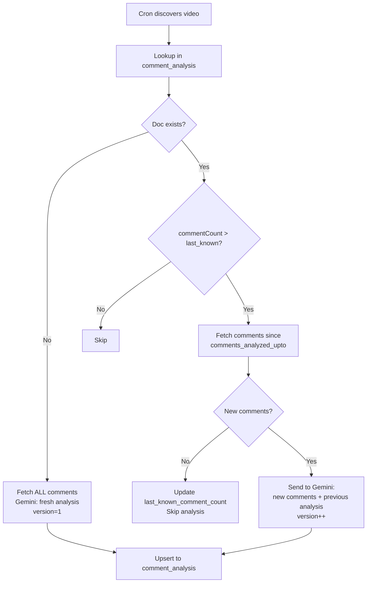

### API Endpoints

**Per-channel endpoints** under `/api/v1/channels/{channel_id}/comment-analysis/`:

| Method | Path | Description |
|---|---|---|
| `POST` | `/trigger` | Manually trigger a comment-analysis cycle for this channel |
| `GET` | `/history` | List all comment analyses (filters: `source`, `platform`, `limit`) |
| `GET` | `/{analysis_id}` | Get a specific comment analysis by MongoDB `_id` |
| `DELETE` | `/{analysis_id}` | Delete a specific comment analysis |
| `DELETE` | `/` | Delete all comment analyses for the channel |
| `GET` | `/aggregate` | Aggregate all analyses into a combined demand/sentiment report |

**Global config endpoints** under `/api/v1/comment-analysis/config/`:

| Method | Path | Description |
|---|---|---|
| `GET` | `/` | Get the current cron schedule config (`analysis_hour` in IST) |
| `PUT` | `/` | Update the cron schedule. Body: `{"analysis_hour": 4}` (0-23 IST). No restart needed. |

### Instagram Limitation

Instagram Graph API only allows fetching comments on media owned by the authenticated account. Therefore, **Instagram comment analysis only works for own-channel videos**, not competitors. YouTube has no such restriction — competitor video comments are fully accessible via the public API.

---

## Automated Comment Reply System

The comment reply system automatically replies to positive comments on published videos with a subscribe-nudge message. It runs as a background cron job (default every 6 hours) and works on both YouTube and Instagram.

### How It Works

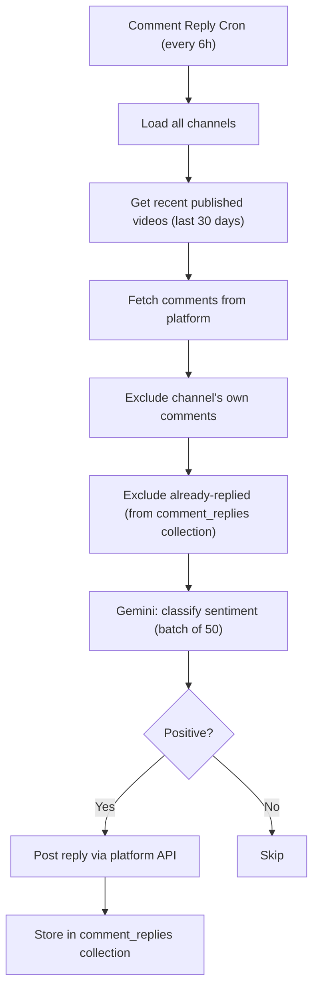

### Sentiment Classification

Gemini classifies each comment into one of four categories:
- **positive**: Genuine appreciation, excitement, praise, or love for the content
- **negative**: Complaints, criticism, or dissatisfaction
- **neutral**: Questions, factual statements, or remarks with no clear sentiment
- **spam**: Self-promotion, gibberish, irrelevant links, or bot-like content

Only **positive** comments receive auto-replies.

### Duplicate Prevention

The `comment_replies` collection has a unique index on `(channel_id, comment_id)`. Before replying, the engine checks this collection to skip comments that have already been replied to. This prevents double-replies even if the cron runs frequently.

### Own-Comment Filtering

- **YouTube**: Comments are filtered by `author_channel_id` — comments from the channel's own `youtube_channel_id` are excluded
- **Instagram**: Comments are filtered by `author` (username) — comments from the channel's own username are excluded

### Configuration

Stored in the `config` collection under key `comment_reply_config`:

| Field | Type | Default | Description |
|-------|------|---------|-------------|
| `enabled` | bool | `true` | Enable/disable the auto-reply system |
| `reply_templates` | string[] | 3 templates | Messages to randomly pick from when replying |
| `max_replies_per_run` | int | `50` | Cap on total replies per cron cycle per channel |
| `max_videos_per_run` | int | `10` | Max videos to process per cycle |
| `video_recency_days` | int | `30` | Only process videos published within this many days |
| `interval_hours` | int | `6` | Hours between cron cycles |

### API Endpoints

**Per-channel endpoints** under `/api/v1/channels/{channel_id}/comment-replies/`:

| Method | Path | Description |
|--------|------|-------------|
| `POST` | `/trigger` | Manually trigger a reply cycle for this channel |
| `GET` | `/history` | List replied comments (filters: `video_id`, `limit`) |

**Global config endpoints** under `/api/v1/comment-replies/config/`:

| Method | Path | Description |
|--------|------|-------------|
| `GET` | `/` | Get the current reply configuration |
| `PUT` | `/` | Update configuration (all fields optional). No restart needed. |

### Liking/Hearting Limitation

Neither YouTube nor Instagram exposes an API method to like or heart a comment as the channel owner. YouTube's `comments` resource has no `rate` or `heart` endpoint. Instagram only supports `hide`, `delete`, and `replies` on comments. Therefore, **only replying is supported**.

### Files

| File | Description |
|------|-------------|
| `app/services/comment_reply_engine.py` | Core orchestration logic (`run_comment_reply_cycle`) |
| `app/services/comment_reply_cron.py` | Background cron loop |
| `app/routers/comment_replies.py` | API endpoints (trigger, history, config) |
| `app/services/gemini.py` | `classify_comment_sentiment()` method |
| `app/services/youtube.py` | `reply_to_comment()` method |
| `app/services/instagram.py` | `reply_to_comment()` method |

---

## Retention Analysis System

The retention analysis system uses **Gemini's multimodal capabilities** to analyze actual video files and predict audience retention before a video is published. Once the video is live and has real metrics, predictions are compared against actual performance.

### How It Works

1. When a video moves to **`ready`** status (via `POST /upload` or `POST /create`), a background task is automatically fired
2. The task downloads the video from R2, uploads it to Gemini for multimodal analysis
3. Gemini analyzes the video's visual pacing, hook quality, scene cuts, and narrative structure
4. A structured retention prediction is stored in the `retention_analysis` collection
5. Later, when `POST /analysis/update` processes the published video, actual metrics are **backfilled** into the same document

### Prediction Pipeline

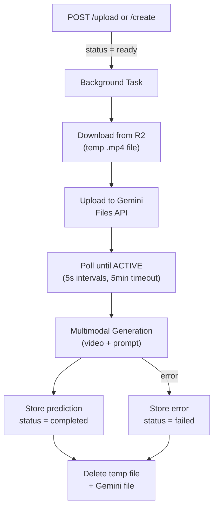

### Actual Metrics Backfill

When the existing analysis pipeline (`POST /analysis/update`) processes a published video that has a retention prediction, it automatically copies the actual metrics into the `retention_analysis` document:

- `actual_avg_percentage_viewed` -- from YouTube Analytics
- `actual_engagement_rate`, `actual_views`, `actual_like_rate`, `actual_comment_rate`
- `actual_views_per_subscriber`
- `actual_performance_rating` -- from Gemini's `ai_insight.performance_rating`
- `actual_stats_snapshot` -- full raw stats for completeness

### Comparison

The `GET /{video_id}` endpoint automatically includes a `comparison` sub-object when actuals are available:

```json
{
  "comparison": {
    "predicted_avg_retention_percent": 62.5,
    "actual_avg_percentage_viewed": 58.3,
    "retention_deviation": 4.2,
    "retention_accuracy_pct": 95.8,
    "prediction_quality": "accurate"
  }
}
```

`prediction_quality` is `"accurate"` (accuracy >= 85%), `"close"` (70-84%), or `"off"` (< 70%).

### API Endpoints

**Per-channel endpoints** under `/api/v1/channels/{channel_id}/retention-analysis/`:

| Method | Path | Description |
|---|---|---|
| `GET` | `/history` | List retention analyses (filters: `status`, `limit`) |
| `GET` | `/{video_id}` | Get retention analysis with computed `comparison` if actuals exist |
| `POST` | `/{video_id}/trigger` | Manually trigger (re-)analysis for a video in ready/scheduled/published status with R2 file |
| `DELETE` | `/{video_id}` | Delete a retention analysis |

### Scope

- **Only own-channel videos with R2 files** are eligible (the system needs the actual video file)
- Automatically triggered when a video reaches `ready` status
- Can also be manually triggered via `POST /{video_id}/trigger`

---

## Data Flow Diagrams

### Video Status Lifecycle

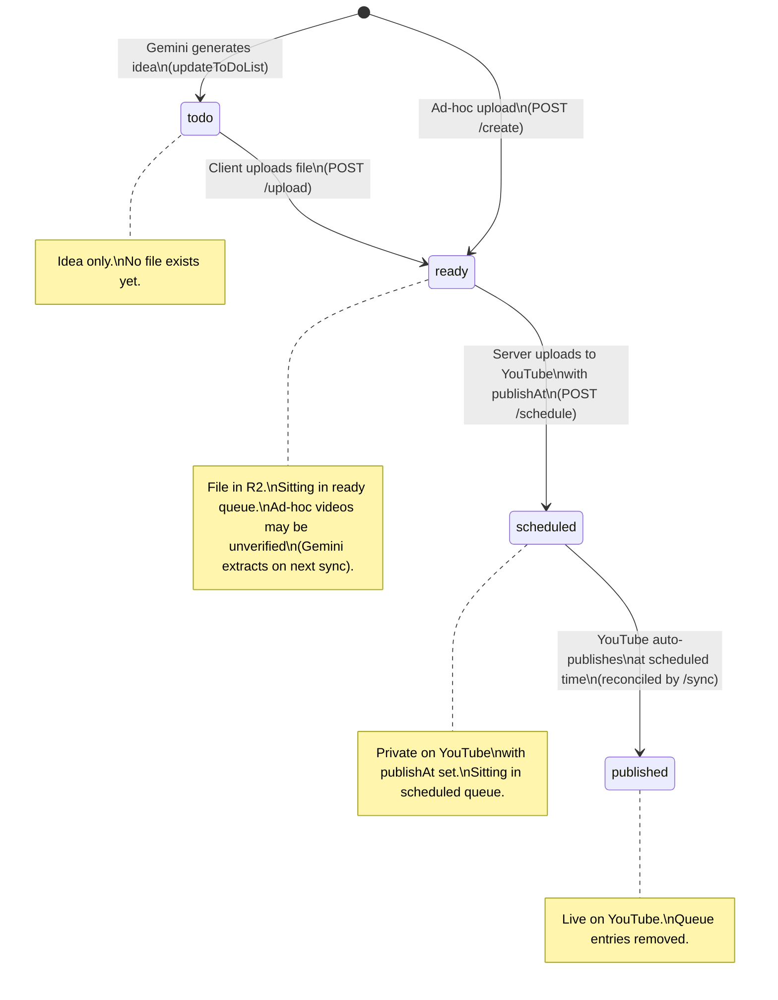

### System Architecture

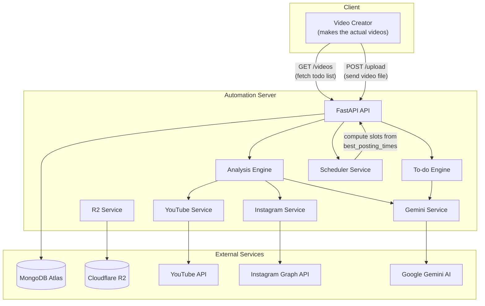

### Video Upload and Schedule Flow

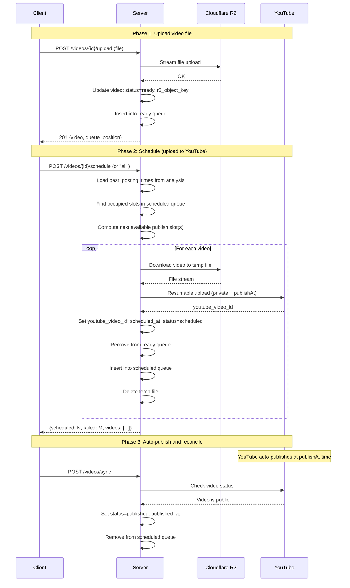

### Sync Flow

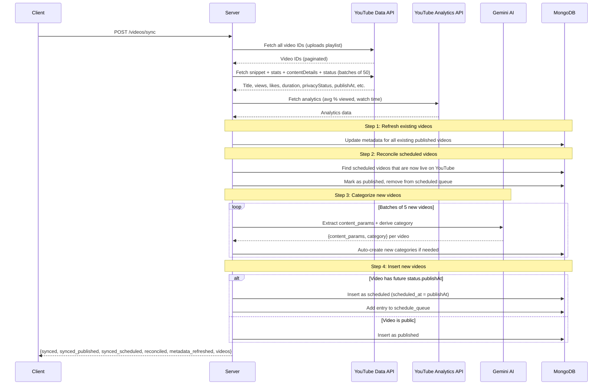

### Analysis Flow

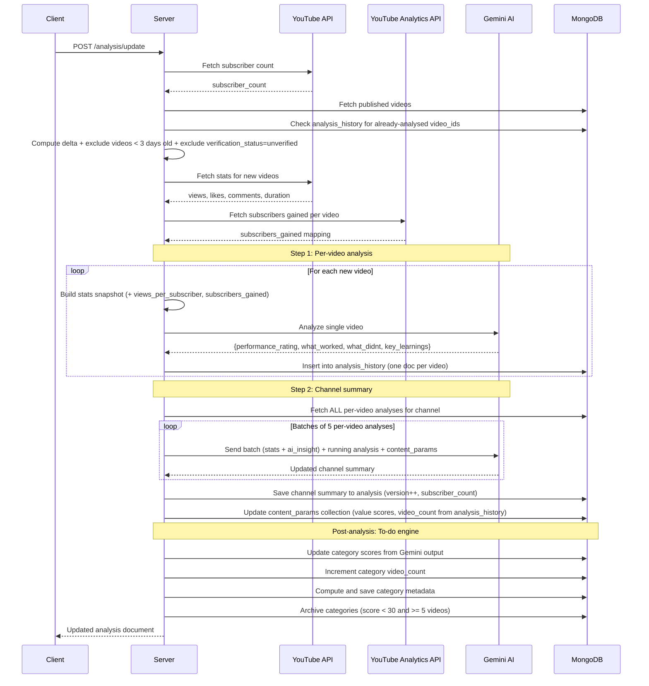

### To-do Video Generation Flow

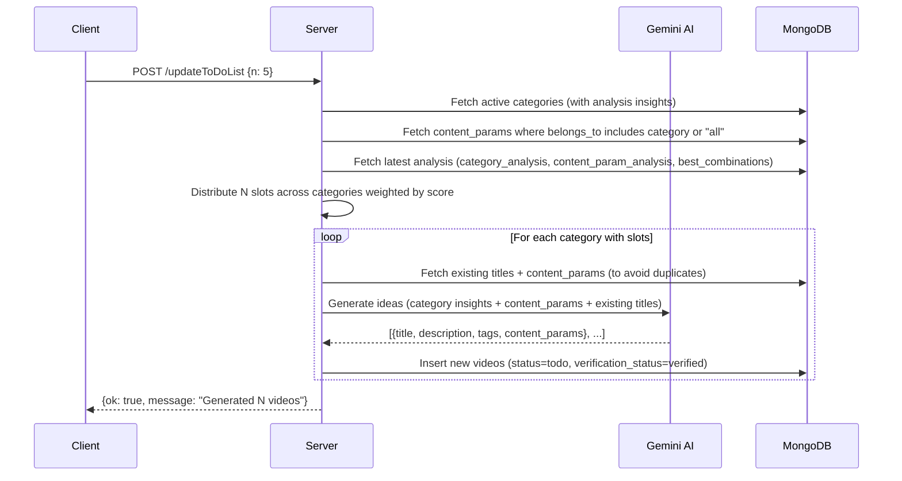

### Content Params Extraction Flow

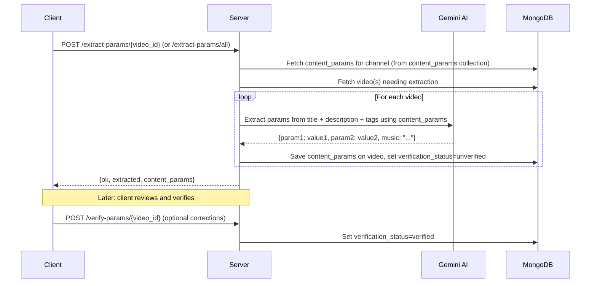

### Scheduling Slot Computation

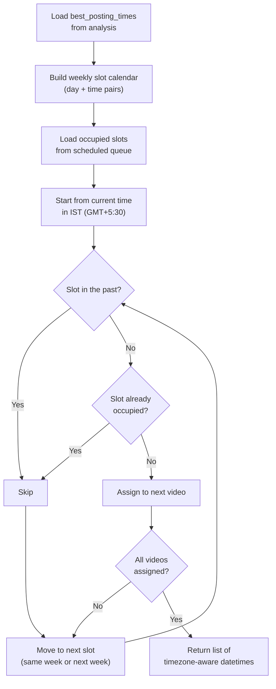
