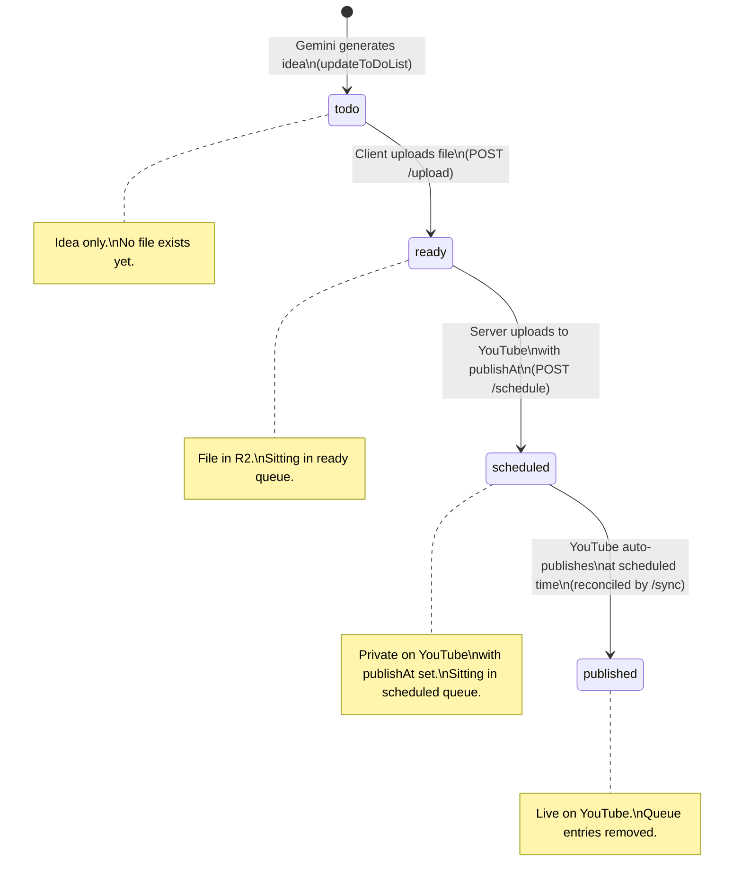
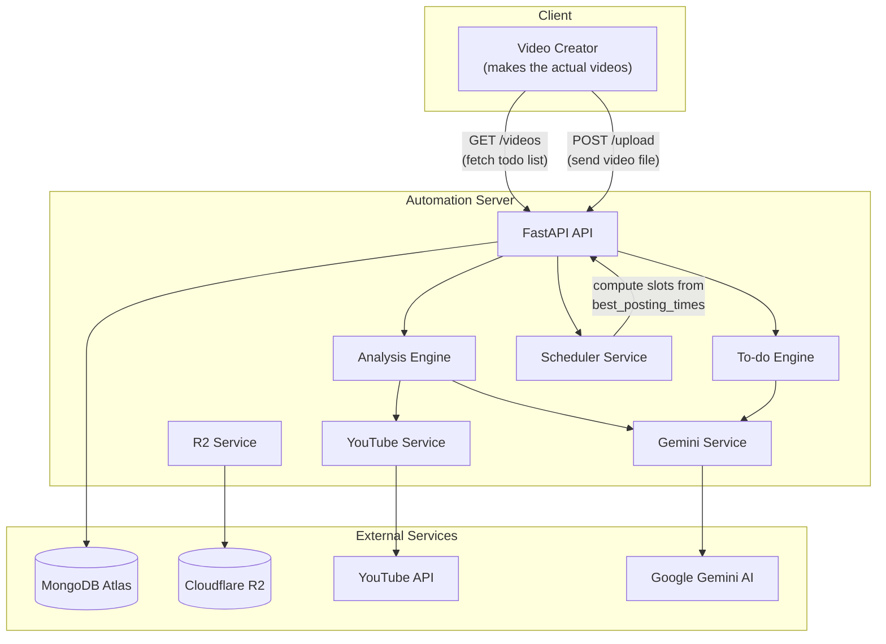
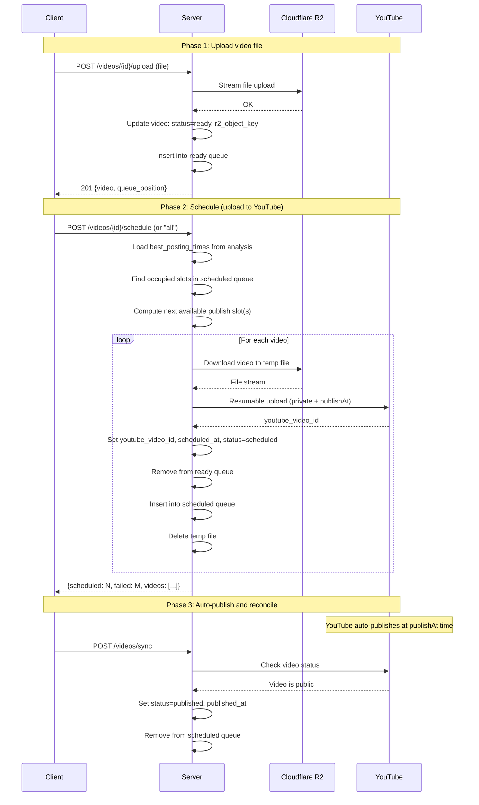
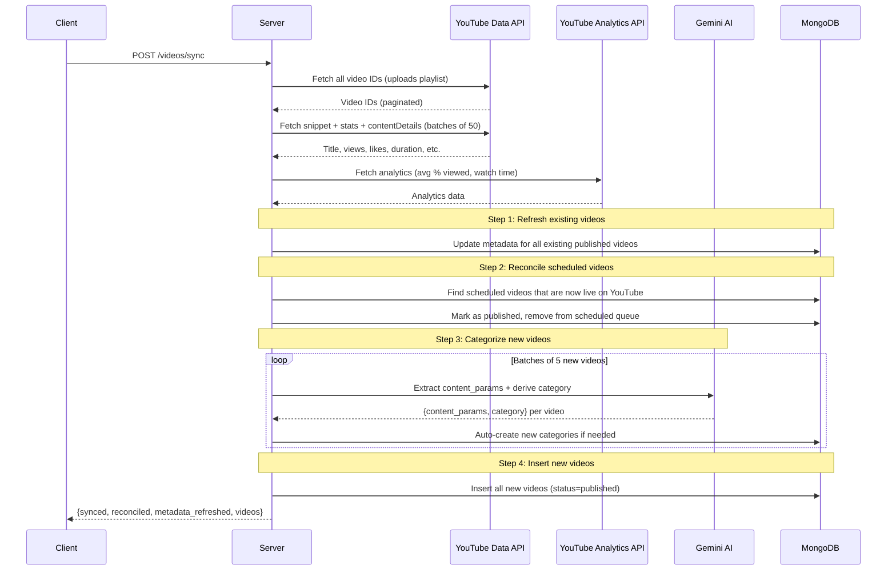
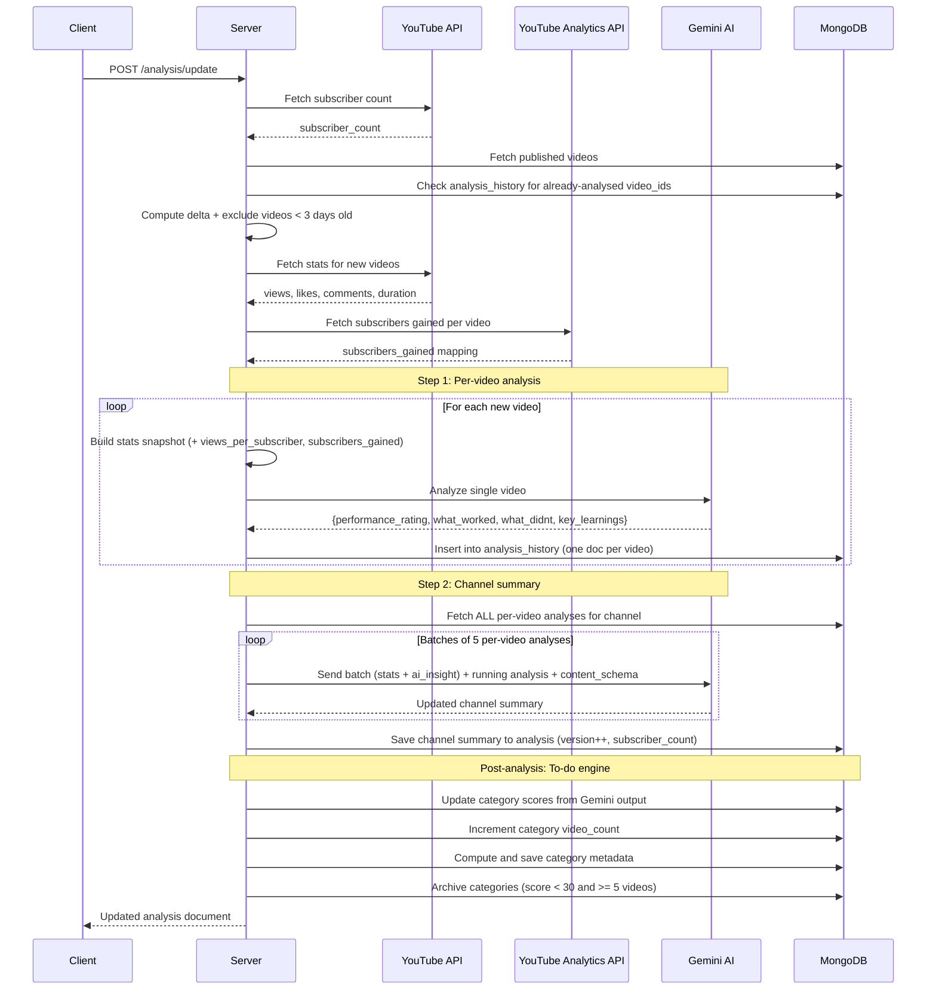
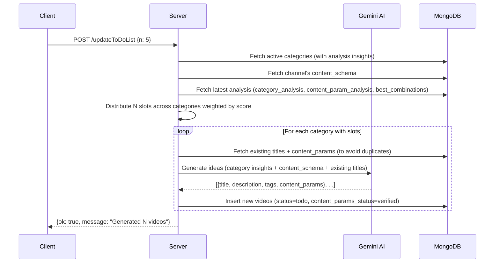
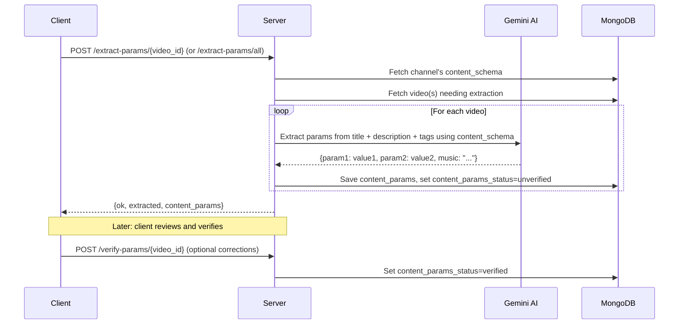
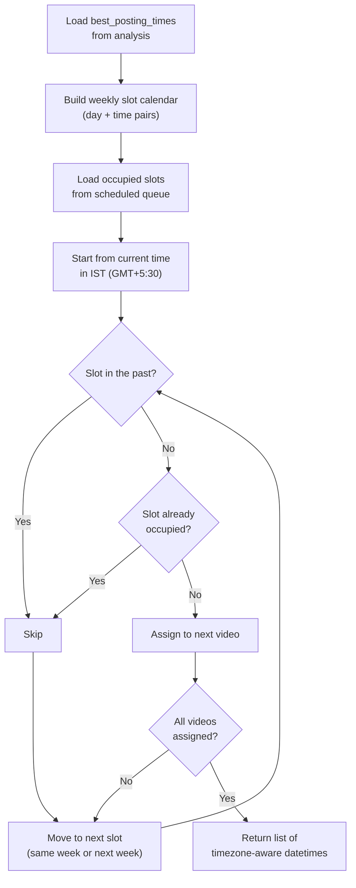

# YouTube Automation Server – Documentation

## Table of Contents

- [Authentication](#authentication)
- [API Endpoints](#api-endpoints)
  - [Health](#health)
  - [API Schema](#api-schema)
  - [Channels](#channels)
  - [Videos](#videos)
  - [Categories](#categories)
  - [Analysis](#analysis)
- [Database Schema](#database-schema)
  - [channels](#collection-channels)
  - [videos](#collection-videos)
  - [posting_queue (Ready Queue)](#collection-posting_queue-ready-queue)
  - [schedule_queue (Scheduled Queue)](#collection-schedule_queue-scheduled-queue)
  - [categories](#collection-categories)
  - [analysis](#collection-analysis)
  - [analysis_history](#collection-analysis_history)
- [Services Architecture](#services-architecture)
- [Data Flow Diagrams](#data-flow-diagrams)
  - [Video Status Lifecycle](#video-status-lifecycle)
  - [System Architecture](#system-architecture)
  - [Video Upload and Schedule Flow](#video-upload-and-schedule-flow)
  - [Sync Flow](#sync-flow)
  - [Analysis Flow](#analysis-flow)
  - [To-do Video Generation Flow](#to-do-video-generation-flow)
  - [Content Params Extraction Flow](#content-params-extraction-flow)
  - [Scheduling Slot Computation](#scheduling-slot-computation)

---

## Authentication

**All endpoints** (except `/health`) require an API key passed in the `X-API-Key` header.

```
X-API-Key: your-secret-key
```

- The key is validated against the `API_KEY` value in `.env`.
- Invalid or missing keys return `401 Unauthorized`.

---

## Timezone Convention

**All timestamps** throughout the system use **IST (GMT+5:30)** — both in the code and in the database.

- A central helper `now_ist()` (in `app/timezone.py`) returns the current timezone-aware IST datetime.
- All model `default_factory` values, all `created_at` / `updated_at` / `published_at` / `scheduled_at` / `added_at` fields use IST.
- YouTube API publish dates are converted to IST before storage.
- The scheduling engine uses `Asia/Kolkata` (equivalent to GMT+5:30) for computing publish slots.

---

## API Endpoints

Base URL: `http://localhost:8000`

All channel-scoped endpoints are prefixed with `/api/v1/channels/{channel_id}/` where `channel_id` is the internal slug for the channel (e.g. `tech-tips`).

---

### Health

#### `GET /health`

Simple liveness check. No authentication required.

**Response:**

```json
{ "status": "ok" }
```

---

### API Schema

#### `GET /api/schema`

Returns the full API schema with method, path, description, request body, query params, and example response for every endpoint. Useful for building clients, documentation, or AI integrations. No authentication required.

**Response:**

```json
{
  "service": "YouTube Automation Server",
  "version": "1.0.0",
  "auth": { "header": "X-API-Key", "required_for": "/api/v1/*" },
  "endpoints": [
    {
      "group": "Videos",
      "method": "GET",
      "path": "/api/v1/channels/{channel_id}/videos/",
      "description": "List videos with sync status",
      "query_params": { "status_filter": { "type": "string", "enum": ["todo","ready","scheduled","published"], "optional": true } },
      "request": null,
      "response": { "videos": ["..."], "sync_status": {"...": "..."} }
    }
  ]
}
```

---

### Channels

Prefix: `/api/v1/channels`

Manages YouTube channel registration. Channel data is **auto-fetched from YouTube** on registration.

---

#### `POST /` — Register a new channel

Creates a channel by fetching its data from the YouTube API. You only need to provide the YouTube channel ID.

**Request body:**

```json
{
  "youtube_channel_id": "UCxxxxxxxx", // required – the UC... ID from YouTube
  "channel_id": "my-channel" // optional – custom slug, auto-generated if omitted
}
```

**What happens:**

1. Server calls YouTube API to fetch channel name, description, subscriber count, video count, view count, thumbnail, and custom URL.
2. If `channel_id` is not provided, one is auto-generated from the YouTube custom URL or channel name.
3. All data is stored in the `channels` collection.

**Response (201):**

```json
{
  "_id": "65f...",
  "channel_id": "tech-tips",
  "youtube_channel_id": "UCxxxxxxxx",
  "name": "Tech Tips Daily",
  "description": "Daily tech tutorials and reviews...",
  "custom_url": "@techtips",
  "thumbnail_url": "https://yt3.ggpht.com/...",
  "subscriber_count": 125000,
  "video_count": 342,
  "view_count": 15000000,
  "created_at": "2024-01-15T10:30:00Z",
  "updated_at": "2024-01-15T10:30:00Z"
}
```

**Errors:**

- `404` — YouTube channel ID not found on YouTube
- `409` — Channel with that `channel_id` already exists
- `503` — YouTube service not initialised

---

#### `GET /` — List all channels

Returns all registered channels.

**Response (200):**

```json
[
  {
    "_id": "65f...",
    "channel_id": "tech-tips",
    "name": "Tech Tips Daily",
    "subscriber_count": 125000,
    ...
  }
]
```

---

#### `GET /{channel_id}` — Get a single channel

**Path params:** `channel_id` — internal slug

**Response (200):** Full channel document.

**Errors:** `404` — Channel not found.

---

#### `PUT /{channel_id}/content-schema` — Define content parameter schema

Sets or replaces the channel's content parameter schema. This defines the custom dimensions (e.g. `simulation_type`, `challenge_mechanic`, `music`) that videos in this channel are tagged with.

**Request body:**

```json
{
  "content_schema": [
    {
      "name": "simulation_type",
      "description": "The type of simulation in the video",
      "values": ["battle", "survival", "puzzle", "race"]
    },
    {
      "name": "challenge_mechanic",
      "description": "The core challenge format",
      "values": ["1v1", "tournament", "survival", "time-trial"]
    },
    {
      "name": "music",
      "description": "Background music style",
      "values": []
    }
  ]
}
```

- `name` — parameter key used in `content_params` on videos
- `description` — what this parameter represents
- `values` — allowed values; empty list means free-form (Gemini infers)

For the **officialgeoranking** channel, the schema includes **video_topic** (the thing the video is ranking different regions/states/countries/cities on) and **ranking_factor** (the factor on which to rank contenders — e.g. a metric, report, or study). Both are free-form (`values: []`).

**Response (200):** `{"ok": true, "channel_id": "...", "params_defined": 3}`

---

#### `POST /{channel_id}/refresh` — Re-fetch data from YouTube

Pulls the latest stats (subscriber count, video count, etc.) from YouTube and updates the DB.

**Response (200):**

```json
{
  "ok": true,
  "channel_id": "tech-tips",
  "updated": {
    "name": "Tech Tips Daily",
    "subscriber_count": 126000,
    "video_count": 345,
    ...
  }
}
```

---

#### `PATCH /{channel_id}` — Update a channel

Partially update channel fields.

**Request body:**

```json
{
  "name": "New Channel Name" // optional
}
```

**Response (200):** `{"ok": true, "channel_id": "tech-tips"}`

---

#### `DELETE /{channel_id}` — Delete a channel

**⚠️ Destructive operation.** Removes the channel AND all associated data:

- All videos in the `videos` collection for this channel
- All entries in `video_queue` for this channel
- All categories for this channel
- The analysis document for this channel

**Response (200):** `{"ok": true, "channel_id": "tech-tips", "deleted": true}`

---

### Videos

Prefix: `/api/v1/channels/{channel_id}/videos`

Manages the video list — both manually created to-do items and AI-generated suggestions.

---

#### `GET /` — List videos

Returns all videos for a channel, with optional filtering and suggestion marking.

**Query params:**

| Param                   | Type   | Default | Description                                                                                           |
| ----------------------- | ------ | ------- | ----------------------------------------------------------------------------------------------------- |
| `status_filter`         | string | `all`   | Filter by status: `todo`, `ready`, `scheduled`, `published`, or `all`                                 |
| `content_params_status` | string | —       | Filter by param status: `unverified`, `verified`, or `missing`                                        |
| `suggest_n`             | int    | —       | If provided, marks the top N to-do videos as `suggested=true` (ordered by category score, best first) |

**How `suggest_n` works:**

1. Resets all previously suggested videos (`suggested=false`)
2. Fetches active categories sorted by score (highest first)
3. Sorts to-do videos by their category's score
4. Marks the top N as `suggested=true`
5. Returns the full video list

**Response (200):**

The response is a wrapper with `videos` (the array) and `sync_status` (how many videos need syncing).

```json
{
  "videos": [
    {
      "channel_id": "tech-tips",
      "video_id": "550e8400-e29b-41d4-a716-446655440000",
      "title": "10 VS Code Tricks You Didn't Know",
      "description": "In this video...",
      "tags": ["vscode", "productivity", "coding"],
      "category": "Tutorials",
      "status": "todo",
      "suggested": true,
      "youtube_video_id": null,
      "r2_object_key": null,
      "metadata": {
        "views": null,
        "likes": null,
        "comments": null,
        "duration_seconds": null,
        "engagement_rate": null,
        "like_rate": null,
        "comment_rate": null,
        "avg_percentage_viewed": null,
        "avg_view_duration_seconds": null,
        "estimated_minutes_watched": null
      },
      "scheduled_at": null,
      "published_at": null,
      "created_at": "2024-01-15T10:30:00Z",
      "updated_at": "2024-01-15T10:30:00Z"
    }
  ],
  "sync_status": {
    "available": true,
    "youtube_total": 60,
    "in_database": 55,
    "new_videos_to_import": 5,
    "pending_reconciliation": 2,
    "metadata_to_refresh": 55
  }
}
```

`sync_status` fields:

- `youtube_total` — total videos on the YouTube channel
- `in_database` — videos in our DB that have a `youtube_video_id`
- `new_videos_to_import` — videos on YouTube not yet in the DB
- `pending_reconciliation` — videos in `scheduled` status whose YouTube video is actually live (public) on YouTube (reconciled to `published` on next sync)
- `metadata_to_refresh` — existing videos whose stats will be refreshed on next sync

---

#### `POST /sync` — Sync videos from YouTube

Fetches all videos from the YouTube channel, finds any not already in the DB, categorizes them via Gemini (auto-creating categories from the channel description), and inserts them as `done`.

**Optional request body:**

```json
{
  "new_category_description": "Extra instructions for Gemini on how to categorize"
}
```

**What happens:**

1. Fetches all videos from the channel's uploads playlist (paginated) — pulls `snippet`, `statistics`, and `contentDetails` (duration)
2. Enriches with YouTube Analytics API data (`avg_percentage_viewed`, `avg_view_duration_seconds`, `estimated_minutes_watched`) when available
3. **Refreshes metadata** for all existing published videos in the DB — updates views, likes, comments, engagement rates, analytics, etc. with the latest data from YouTube
4. **Reconciles scheduled videos** — finds all videos in the DB with status `scheduled` and checks YouTube to see if they are actually live (privacy status is `public`). If live, marks them as `published`, sets `published_at` from YouTube's publish time, and cleans up their `schedule_queue` entry
5. Skips any already in the `videos` collection (by `youtube_video_id`)
6. **Extracts content params AND derives category** for new videos in batches of 5 via a single Gemini call — extracts `content_params` (including music) based on the channel's `content_schema`, then derives `category` from those extracted parameters (not from title/description/tags directly). Content params are saved as `"unverified"`
7. Auto-creates new categories with `score: 0` and `video_count: 0` (scores/counts are updated later during analysis)
8. Inserts videos as `published` with `category`, `content_params`, and `content_params_status` assigned; `created_at` and `published_at` are set to the **YouTube publish date**; `metadata` is fully populated

**Response (200):**

```json
{
  "ok": true,
  "synced": 15,
  "reconciled": 2,
  "metadata_refreshed": 45,
  "categories_created": ["Tutorials", "Reviews", "Vlogs"],
  "videos": [
    {
      "title": "10 VS Code Tricks",
      "category": "Tutorials"
    },
    {
      "title": "iPhone 16 Review",
      "category": "Reviews"
    }
  ]
}
```

---

#### `PATCH /{video_id}/status` — Update video status

Changes a video's status.

**Path params:** `video_id` — the UUID of the video

**Request body:**

```json
{
  "status": "published" // "todo", "ready", "scheduled", or "published"
}
```

**Side effects:**

- When marking a video as `published`, the corresponding category's `video_count` is incremented by 1.
- When marking as `published`, `published_at` is automatically set to the current time.

**Response (200):**

```json
{ "ok": true, "video_id": "550e8400-...", "status": "done" }
```

---

#### `POST /{video_id}/extract-params` — Extract content params via Gemini

Uses Gemini to extract content parameter values from a video's title, description, and tags, based on the channel's `content_schema`. Results are saved with `content_params_status: "unverified"`.

**Preconditions:** Channel must have a `content_schema` defined.

**Response (200):**

```json
{
  "ok": true,
  "video_id": "550e8400-...",
  "content_params": {
    "simulation_type": "battle",
    "challenge_mechanic": "1v1",
    "music": "Epic Orchestral - Two Steps From Hell"
  },
  "content_params_status": "unverified"
}
```

---

#### `POST /extract-params/all` — Bulk extract params for all videos

Extracts content parameters for every video in the channel that doesn't have them yet. Runs Gemini extraction one video at a time.

**Response (200):**

```json
{
  "ok": true,
  "extracted": 42,
  "total": 45
}
```

---

#### `POST /{video_id}/verify-params` — Verify content params

Marks a video's content_params as `"verified"`. Optionally pass corrected values in the body.

**Request body (optional):**

```json
{
  "content_params": {
    "simulation_type": "survival",
    "challenge_mechanic": "tournament",
    "music": "Dramatic Piano - Ludovico Einaudi"
  }
}
```

**Response (200):**

```json
{
  "ok": true,
  "video_id": "550e8400-...",
  "content_params": { "..." },
  "content_params_status": "verified"
}
```

---

#### `POST /{video_id}/upload` — Upload video file

Uploads a video file for an existing `todo` video, streams it to Cloudflare R2, sets status to `ready`, and adds it to the ready queue.

**Request:** `multipart/form-data`

| Field  | Type          | Description                |
| ------ | ------------- | -------------------------- |
| `file` | File (binary) | The video file (.mp4)      |
| `body` | JSON string   | Video metadata (see below) |

**Body JSON:**

```json
{
  "title": "My Video Title", // required
  "description": "Description...", // optional
  "tags": ["tag1", "tag2"], // optional
  "category": "Tutorials" // optional
}
```

**What happens:**

1. Verifies the video exists and is in `todo` status
2. Streams the file to R2 at `{channel_id}/{video_id}.mp4`
3. Updates the video document: status → `ready`, sets `r2_object_key`
4. Creates an entry in the ready queue with the next available position

**Response (201):**

```json
{
  "ok": true,
  "video": { ...full video document... },
  "queue_position": 3
}
```

---

#### `POST /{video_id}/schedule` — Schedule ready video(s)

Schedules video(s) on YouTube. Computes a publish time, uploads the video file to YouTube as private with `publishAt`, and **only on success**: removes from the ready queue, adds to the scheduled queue, sets status to `scheduled`.

**Path params:** `video_id` — the UUID of a single video **OR** `"all"` to schedule every video in the ready queue.

**Preconditions:**

- The video(s) must be in `ready` status (uploaded to R2). Returns `400` otherwise.
- A channel analysis with `best_posting_times` must exist. Returns `400` if missing.
- A valid YouTube token must exist for the channel. Returns `503` if missing.

**What happens:**

1. If `video_id` is `"all"`, fetches all entries from the ready queue; otherwise fetches the single video
2. Loads `best_posting_times` from the latest analysis document
3. Gathers `scheduled_at` values from existing scheduled queue entries (occupied slots)
4. Computes the next available publish slot(s) from the weekly calendar, skipping past and occupied slots (timezone from `TIMEZONE` env var, default `Asia/Kolkata`)
5. For each video: downloads from R2, uploads to YouTube as private with `publishAt`. **Only on YouTube upload success**: removes from the ready queue, inserts into the scheduled queue with `scheduled_at`, sets `youtube_video_id`, updates status to `scheduled`

The video remains in `scheduled` status until YouTube auto-publishes it at the `publishAt` time. The sync endpoint then reconciles it to `published`.

**Response (200):**

```json
{
  "ok": true,
  "scheduled": 2,
  "failed": 0,
  "videos": [
    {
      "video_id": "550e8400-...",
      "status": "scheduled",
      "youtube_video_id": "dQw4w...",
      "scheduled_at": "2026-03-10T10:00:00+05:30"
    },
    {
      "video_id": "660f9500-...",
      "status": "scheduled",
      "youtube_video_id": "xYz1a...",
      "scheduled_at": "2026-03-10T14:00:00+05:30"
    }
  ]
}
```

**Errors:**

- `400` — No analysis with `best_posting_times` found
- `400` — Not enough posting slots for the number of videos
- `404` — Video not found / no videos in ready queue
- `503` — No YouTube token for the channel

---

#### `POST /updateToDoList` — Bulk generate to-do videos

Generates completely distinct new video ideas based on the latest analysis.

**Request body:**

```json
{
  "n": 5 // number of videos to generate
}
```

**What happens:**

1. **Delete** any existing "todo" status videos that belong to newly archived categories.
2. **Distribute** the `n` slots across active categories weighted by their performance score.
3. **Exclude** existing video titles from generation so Gemini doesn't repeat ideas.
4. **Call Gemini** to bulk-generate distinct ideas in one shot per category.
5. **Insert** new videos into the `videos` collection with `status: "todo"`.

**Response (200):**

```json
{
  "ok": true,
  "message": "Successfully generated 5 new videos for the to-do list."
}
```

---

### Categories

Prefix: `/api/v1/channels/{channel_id}/categories`

Manages content categories (e.g. "Tutorials", "Reviews"). Categories drive the analysis engine and to-do video generation.

---

#### `GET /` — List categories

Returns all categories sorted by score (highest first).

**Query params:**

| Param           | Type   | Default | Description                              |
| --------------- | ------ | ------- | ---------------------------------------- |
| `status_filter` | string | —       | Filter by status: `active` or `archived` |

**Response (200):**

```json
[
  {
    "_id": "65f...",
    "channel_id": "tech-tips",
    "name": "Tutorials",
    "description": "How-to videos and walkthroughs",
    "raw_description": "Original user-provided description",
    "score": 85.5,
    "status": "active",
    "video_count": 12,
    "metadata": {
      "total_videos": 12,
      "avg_views": 1500.0,
      "avg_likes": 15.5,
      "avg_comments": 3.2,
      "avg_duration_seconds": 28.0,
      "avg_engagement_rate": 1.25,
      "avg_like_rate": 1.03,
      "avg_comment_rate": 0.22,
      "avg_percentage_viewed": 72.5,
      "avg_view_duration_seconds": 20,
      "total_views": 18000,
      "total_estimated_minutes_watched": 560.0
    },
    "created_at": "2024-01-15T10:30:00Z",
    "updated_at": "2024-01-15T10:30:00Z"
  }
]
```

---

#### `POST /` — Add categories

Accepts a **single category** or a **list of categories**.

**Request body (single):**

```json
{
  "name": "Tutorials",
  "description": "How-to videos",
  "raw_description": "Original description",
  "score": 80.0
}
```

**Request body (batch):**

```json
[
  { "name": "Tutorials", "description": "How-to videos", "score": 80 },
  { "name": "Reviews", "description": "Product reviews", "score": 70 }
]
```

**Response (201):**

```json
{
  "ok": true,
  "inserted_count": 2,
  "ids": ["65f...", "65f..."]
}
```

---

#### `PATCH /{category_id}` — Update a category

**Path params:** `category_id` — the MongoDB `_id` of the category

**Request body (all fields optional):**

```json
{
  "name": "Updated Name",
  "description": "Updated description",
  "raw_description": "Updated raw desc",
  "score": 92.0,
  "status": "archived"
}
```

**Response (200):** `{"ok": true, "category_id": "65f..."}`

---

### Analysis

Prefix: `/api/v1/channels/{channel_id}/analysis`

AI-powered channel analysis using Gemini. Analyzes video performance and generates insights.

---

#### `POST /update` — Run full analysis update

**Two-step pipeline** — calls YouTube API + Gemini AI. May take 30+ seconds.

**Step 1 — Per-video analysis:**

1. **Fetch subscriber count** from YouTube via `get_channel_info()`
2. **Fetch done videos** from DB for this channel
3. **Compute delta** — compare with `analysis_history` collection to find videos not yet individually analysed
4. **Exclude recent videos** — skip any with `created_at` less than 3 days ago (hard limit, no exceptions)
5. **Fetch YouTube stats** (views, likes, comments, duration, engagement rates) + **YouTube Analytics** (avg % viewed, avg view duration, est. minutes watched, **subscribers gained**) for new videos
6. **For each new video**: build a stats snapshot (including `views_per_subscriber`, `subscribers_gained`, `subscriber_count_at_analysis`), send to **Gemini for individual analysis** → get `performance_rating` (0-100), `what_worked`, `what_didnt`, `key_learnings`
7. **Store each result** in `analysis_history` collection (one doc per video, never re-analysed)

**Step 2 — Channel summary:**

8. **Fetch ALL per-video analyses** from `analysis_history` for this channel
9. **Send to Gemini in batches of 5** — each batch includes per-video AI insights alongside stats and content_params. Gemini produces collective channel insights: `best_posting_times`, `category_analysis`, `content_param_analysis`, `best_combinations`
10. **Save channel summary** to `analysis` collection with `subscriber_count` (increments version)
11. **Run to-do engine:**
    - Updates **all category scores** from Gemini's analysis output
    - Increments **category video_count** for each newly analysed video
    - **Computes and saves category metadata** — aggregates avg views, likes, comments, engagement rates, avg % viewed, total watch time, etc. from all published videos in each category
    - Archives categories with score < 30 AND ≥ 5 videos

**Response (200):**

```json
{
  "channel_id": "tech-tips",
  "subscriber_count": 5000,
  "best_posting_times": [
    {
      "day_of_week": "monday",
      "video_count": 2,
      "times": ["10:00", "14:00"]
    }
  ],
  "category_analysis": [
    {
      "category": "Tutorials",
      "best_title_patterns": ["How to...", "10 Things..."],
      "score": 85.5
    }
  ],
  "content_param_analysis": [
    {
      "param_name": "simulation_type",
      "best_values": ["battle", "survival"],
      "worst_values": ["puzzle"],
      "insight": "Battle simulations get 3x more engagement"
    }
  ],
  "best_combinations": [
    {
      "params": {"simulation_type": "battle", "challenge_mechanic": "1v1", "music": "Epic Orchestral"},
      "reasoning": "Highest avg_percentage_viewed at 72%"
    }
  ],
  "analysis_done_video_ids": ["vid1", "vid2", "vid3"],
  "version": 3,
  "created_at": "2024-01-15T10:30:00Z",
  "updated_at": "2024-01-20T14:00:00Z"
}
```

---

#### `GET /latest` — Get latest channel summary

Returns the most recent channel summary for the channel, including `subscriber_count` and an `analysis_status` summary.

**Response (200):** Same format as the POST response above, with an additional `analysis_status` field:

```json
{
  "...all analysis fields...",
  "subscriber_count": 5000,
  "analysis_status": {
    "ready_for_analysis": 5,
    "not_ready_yet": 2
  }
}
```

- `ready_for_analysis` — published videos not yet in `analysis_history` and older than 3 days
- `not_ready_yet` — published videos not yet in `analysis_history` but less than 3 days old

**Errors:** `404` — No analysis exists yet for this channel.

---

#### `GET /history` — Get per-video analyses

Returns per-video analyses from the `analysis_history` collection. Each document represents a single video's stats snapshot + AI insight.

**Query params:**

| Param   | Type     | Default | Description                           |
| ------- | -------- | ------- | ------------------------------------- |
| `from`  | datetime | —       | Filter `analyzed_at >= from`          |
| `to`    | datetime | —       | Filter `analyzed_at <= to`            |
| `limit` | int      | 50      | Max number of results                 |

**Response (200):**

```json
[
  {
    "channel_id": "tech-tips",
    "video_id": "uuid-1234",
    "youtube_video_id": "dQw4w...",
    "title": "Epic Battle Simulation",
    "category": "Simulations",
    "content_params": {"simulation_type": "battle", "music": "Epic Orchestral"},
    "stats_snapshot": {
      "views": 15000,
      "likes": 800,
      "comments": 45,
      "engagement_rate": 5.63,
      "avg_percentage_viewed": 72.5,
      "subscribers_gained": 120,
      "views_per_subscriber": 3.0,
      "subscriber_count_at_analysis": 5000
    },
    "ai_insight": {
      "performance_rating": 85,
      "what_worked": "Strong title hook + battle format",
      "what_didnt": "Could improve description SEO",
      "key_learnings": ["Battle sims drive 3x engagement"]
    },
    "analyzed_at": "2026-03-07T12:00:00+05:30"
  }
]
```

---

#### `GET /history/{video_id}` — Get single video analysis

Returns the per-video analysis for a specific video.

**Response (200):** Single per-video analysis document (same format as above).

**Errors:** `404` — No analysis found for this video.

---

#### `GET /compare` — Compare time periods

Aggregates per-video analyses across two time periods for side-by-side comparison.

**Query params (all required):**

| Param   | Type     | Description           |
| ------- | -------- | --------------------- |
| `from1` | datetime | Start of period 1     |
| `to1`   | datetime | End of period 1       |
| `from2` | datetime | Start of period 2     |
| `to2`   | datetime | End of period 2       |

**Response (200):**

```json
{
  "channel_id": "tech-tips",
  "period_1": {
    "from": "2026-02-01T00:00:00",
    "to": "2026-02-15T00:00:00",
    "video_count": 10,
    "avg_views": 12000,
    "avg_likes": 650,
    "avg_comments": 35,
    "avg_engagement_rate": 4.5,
    "avg_percentage_viewed": 68.2,
    "avg_views_per_subscriber": 2.4,
    "total_subscribers_gained": 500,
    "avg_performance_rating": 72.3
  },
  "period_2": {
    "from": "2026-02-16T00:00:00",
    "to": "2026-03-01T00:00:00",
    "video_count": 12,
    "avg_views": 18000,
    "avg_likes": 950,
    "avg_comments": 52,
    "avg_engagement_rate": 5.8,
    "avg_percentage_viewed": 74.1,
    "avg_views_per_subscriber": 3.6,
    "total_subscribers_gained": 850,
    "avg_performance_rating": 81.5
  }
}
```

---

---

## Database Schema

Database: **MongoDB Atlas** (database name from `MONGODB_DB_NAME` env var, default: `youtube_automation`)

All collections are shared across channels, with `channel_id` as a discriminator field. All datetime fields are stored in **IST (GMT+5:30)**.

---

### Collection: `channels`

Stores registered YouTube channels with their metadata (auto-fetched from YouTube).

```json
{
  "_id": "ObjectId",
  "channel_id": "tech-tips", // unique internal slug
  "youtube_channel_id": "UCxxxxxxxx", // YouTube UC... ID
  "name": "Tech Tips Daily", // from YouTube
  "description": "Channel description", // from YouTube
  "custom_url": "@techtips", // from YouTube
  "thumbnail_url": "https://...", // from YouTube
  "subscriber_count": 125000, // from YouTube
  "video_count": 342, // from YouTube
  "view_count": 15000000, // from YouTube
  "content_schema": [  // custom content parameter definitions
    {"name": "simulation_type", "description": "...", "values": ["battle", "survival"]},
    {"name": "music", "description": "...", "values": []}
  ],
  "created_at": "datetime",
  "updated_at": "datetime"
}
```

**Indexes:**
| Fields | Type | Purpose |
|---|---|---|
| `channel_id` | Unique | Fast lookup, prevent duplicates |

---

### Collection: `videos`

Stores all video records — both manually uploaded and AI-generated to-do items.

```json
{
  "_id": "ObjectId",
  "channel_id": "tech-tips",
  "video_id": "550e8400-...", // auto-generated UUID
  "title": "10 VS Code Tricks",
  "description": "In this video...",
  "tags": ["vscode", "productivity"],
  "category": "Tutorials",
  "status": "todo", // "todo", "ready", "scheduled", or "published"
  "suggested": false, // true when marked by suggest_n
  "youtube_video_id": null, // set after YouTube upload
  "r2_object_key": "tech-tips/vid.mp4", // set when file is stored in R2
  "metadata": {
    "views": null, // from YouTube Data API
    "likes": null, // from YouTube Data API
    "comments": null, // from YouTube Data API
    "duration_seconds": null, // from YouTube Data API (contentDetails)
    "engagement_rate": null, // (likes + comments) / views × 100
    "like_rate": null, // likes / views × 100
    "comment_rate": null, // comments / views × 100
    "avg_percentage_viewed": null, // from YouTube Analytics API
    "avg_view_duration_seconds": null, // from YouTube Analytics API
    "estimated_minutes_watched": null // from YouTube Analytics API
  },
  "content_params": {  // channel-specific content dimensions
    "simulation_type": "battle",
    "challenge_mechanic": "1v1",
    "music": "Epic Orchestral - Two Steps From Hell"
  },
  "content_params_status": "unverified", // "unverified" (Gemini-extracted) or "verified" (user-confirmed or system-defined)
  "scheduled_at": "datetime | null", // when the video is scheduled to go live on YouTube; null until scheduled
  "published_at": "datetime | null", // when the video was published on YouTube; null until published
  "created_at": "datetime",
  "updated_at": "datetime"
}
```

**Indexes:**
| Fields | Type | Purpose |
|---|---|---|
| `(channel_id, status)` | Compound | Fast filtered queries |
| `video_id` | Unique | Fast lookup by UUID |

**Status lifecycle:**

- `todo` → Video idea exists (AI-generated or manual), not yet produced
- `ready` → Video file uploaded to R2, sitting in the ready queue
- `scheduled` → Video uploaded to YouTube as private with a future `publishAt`, sitting in the scheduled queue waiting for YouTube to auto-publish
- `published` → Video is live on YouTube; `published_at` is set at this transition (reconciled by the sync endpoint)

---

### Collection: `posting_queue` (Ready Queue)

The **ready queue**. Stores videos that are **ready** — uploaded to R2 but not yet scheduled on YouTube. Each entry references a video by `video_id`.

```json
{
  "_id": "ObjectId",
  "channel_id": "tech-tips",
  "video_id": "550e8400-...", // references videos.video_id
  "position": 1, // 1-based ordering
  "added_at": "datetime"
}
```

**Indexes:**
| Fields | Type | Purpose |
|---|---|---|
| `(channel_id, position)` | Compound | Fast ordered queue retrieval |

**Notes:**

- Entries are removed when the video is successfully scheduled on YouTube (moved to the scheduled queue).
- Position determines the display order.

---

### Collection: `schedule_queue` (Scheduled Queue)

The **scheduled queue**. Stores videos that are **scheduled** — already uploaded to YouTube as private with a `publishAt` time, waiting for YouTube to auto-publish. Each entry references a video by `video_id` and includes the target publish time.

```json
{
  "_id": "ObjectId",
  "channel_id": "tech-tips",
  "video_id": "550e8400-...", // references videos.video_id
  "position": 1, // 1-based ordering
  "scheduled_at": "datetime", // timezone-aware publish time (computed from best_posting_times)
  "added_at": "datetime"
}
```

**Indexes:**
| Fields | Type | Purpose |
|---|---|---|
| `(channel_id, position)` | Compound | Fast ordered queue retrieval |

**Notes:**

- Entries are added when a video is successfully uploaded to YouTube as private with `publishAt` (during the schedule operation).
- Entries are removed when the sync endpoint reconciles them as `published` (YouTube has auto-published them).
- Position determines display order in the queue view.

---

### Collection: `categories`

Stores content categories with their performance scores.

```json
{
  "_id": "ObjectId",
  "channel_id": "tech-tips",
  "name": "Tutorials",
  "description": "How-to videos and walkthroughs",
  "raw_description": "Original user input",
  "score": 85.5, // 0-100, updated by analysis engine
  "status": "active", // "active" or "archived"
  "video_count": 12, // incremented when videos marked done
  "metadata": {
    "total_videos": 12, // published videos in this category
    "avg_views": 1500.0,
    "avg_likes": 15.5,
    "avg_comments": 3.2,
    "avg_duration_seconds": 28.0,
    "avg_engagement_rate": 1.25, // avg (likes+comments)/views × 100
    "avg_like_rate": 1.03,
    "avg_comment_rate": 0.22,
    "avg_percentage_viewed": 72.5, // from YouTube Analytics API
    "avg_view_duration_seconds": 20, // from YouTube Analytics API
    "total_views": 18000,
    "total_estimated_minutes_watched": 560.0
  },
  "created_at": "datetime",
  "updated_at": "datetime"
}
```

**Indexes:**
| Fields | Type | Purpose |
|---|---|---|
| `(channel_id, status, score)` | Compound | Fast sorted queries by active/score |

**Auto-archiving:** The to-do engine archives categories when:

- Score drops below **30** AND
- Category has **≥ 5 videos** (enough data to be statistically meaningful)

---

### Collection: `analysis`

Stores the AI-generated channel summary. **One document per channel.**

```json
{
  "_id": "ObjectId",
  "channel_id": "tech-tips",
  "subscriber_count": 5000, // channel's subscriber count at last analysis
  "best_posting_times": [
    {
      "day_of_week": "monday",
      "video_count": 2,
      "times": ["10:00", "14:00"]
    }
  ],
  "category_analysis": [
    {
      "category": "Tutorials",
      "best_title_patterns": ["How to...", "10 Things..."],
      "score": 85.5
    }
  ],
  "content_param_analysis": [
    {
      "param_name": "simulation_type",
      "best_values": ["battle", "survival"],
      "worst_values": ["puzzle"],
      "insight": "Battle simulations get 3x more engagement"
    }
  ],
  "best_combinations": [
    {
      "params": {"simulation_type": "battle", "challenge_mechanic": "1v1", "music": "Epic Orchestral"},
      "reasoning": "Highest avg_percentage_viewed at 72%"
    }
  ],
  "analysis_done_video_ids": ["vid1", "vid2"], // tracks which videos have been analysed
  "version": 3, // auto-incremented
  "created_at": "datetime",
  "updated_at": "datetime"
}
```

**Indexes:**
| Fields | Type | Purpose |
|---|---|---|
| `channel_id` | Unique | One analysis doc per channel |

---

### Collection: `analysis_history`

Per-video analysis storage — **one document per video**, created once and never re-analysed. Each document contains the video's stats snapshot at analysis time plus AI-generated insights.

```json
{
  "_id": "ObjectId",
  "channel_id": "tech-tips",
  "video_id": "uuid-1234",
  "youtube_video_id": "dQw4w...",
  "title": "Epic Battle Simulation",
  "category": "Simulations",
  "content_params": {
    "simulation_type": "battle",
    "challenge_mechanic": "1v1",
    "music": "Epic Orchestral - Two Steps From Hell"
  },
  "stats_snapshot": {
    "views": 15000,
    "likes": 800,
    "comments": 45,
    "duration_seconds": 35,
    "engagement_rate": 5.63,
    "like_rate": 5.33,
    "comment_rate": 0.3,
    "avg_percentage_viewed": 72.5,
    "avg_view_duration_seconds": 25,
    "estimated_minutes_watched": 6250.0,
    "subscribers_gained": 120, // from YouTube Analytics API
    "views_per_subscriber": 3.0, // views / channel subscriber count
    "subscriber_count_at_analysis": 5000 // channel subs when analysed
  },
  "ai_insight": {
    "performance_rating": 85, // 0-100 score
    "what_worked": "Strong title hook + battle format drove high CTR",
    "what_didnt": "Could improve description SEO for discoverability",
    "key_learnings": [
      "Battle sims drive 3x engagement vs other types",
      "Epic music correlates with higher avg_percentage_viewed"
    ]
  },
  "analyzed_at": "datetime"
}
```

**Indexes:**
| Fields | Type | Purpose |
|---|---|---|
| `(channel_id, video_id)` | Compound (unique) | One analysis per video per channel |
| `(channel_id, analyzed_at)` | Compound (desc) | Fast reverse-chronological queries and date filtering |

---

## Services Architecture

### R2 Service (`app/services/r2.py`)

- **Upload**: Streams file to R2 using `upload_fileobj` (never loads full file into memory)
- **Download**: Streams file from R2 to a temp file, returns the temp file path
- **Delete**: Removes an object from R2
- **Object key format**: `{channel_id}/{video_id}.mp4`

### YouTube Service (`app/services/youtube.py`)

- **Per-channel tokens**: Each channel has its own OAuth token stored at `youtube_tokens/{channel_id}.json`. This ensures analytics data is fetched from the correct account and uploads go to the right channel
- **YouTubeServiceManager**: Manages per-channel `YouTubeService` instances. Lazily creates and caches them on first use. If a channel has no token, endpoints return a clear error with instructions to generate one
- **Token generation**: Run `python generate_youtube_token.py <channel_id>` to create a token for a new channel. Sign in with the Google account that owns that channel
- **Auth**: OAuth2 with stored token (auto-refreshes, initial setup requires browser consent). Scopes: `youtube.upload`, `youtube.readonly`, `yt-analytics.readonly`
- **Get channel info**: Fetches channel metadata (name, subscribers, etc.)
- **Get video stats**: Fetches views, likes, comments, duration (from Data API `statistics` + `contentDetails`), plus computed engagement/like/comment rates. Also merges YouTube Analytics data (avg % viewed, avg view duration, estimated minutes watched) when available
- **Get video analytics**: Queries the YouTube Analytics API for `averageViewPercentage`, `averageViewDuration`, and `estimatedMinutesWatched` per video. Batches by 40 IDs. Returns empty data for videos less than ~48 hours old (YouTube Analytics processing delay)
- **Upload video**: Resumable upload in 10MB chunks, defaults to private. Accepts an optional `publish_at` ISO 8601 UTC datetime — when provided, the video is uploaded as private with YouTube's `publishAt` field so it auto-publishes at the scheduled time

### Timezone Helper (`app/timezone.py`)

- **`IST`** — a `timezone(timedelta(hours=5, minutes=30))` constant
- **`now_ist()`** — returns the current datetime in IST, timezone-aware
- Used by all models, routers, and services as the single source of truth for timestamps

### Scheduler Service (`app/services/scheduler.py`)

- **Compute schedule slots**: Takes `best_posting_times` from analysis, a list of already-occupied datetimes, and the number of videos to schedule
- Builds a weekly slot calendar from `best_posting_times` (day + time pairs)
- Starts from the current moment, walks forward week by week, skipping past and occupied slots
- Returns timezone-aware datetimes (timezone from `TIMEZONE` env var, default `Asia/Kolkata`)
- Safety cap of 52 weeks forward

### YouTube Service (`app/services/youtube.py`) — Additional Methods

- **Get subscribers gained**: `get_subscribers_gained(youtube_video_ids)` — queries YouTube Analytics API for `subscribersGained` per video. Returns `dict[youtube_video_id, int]`. Batches by 40 IDs.

### Gemini Service (`app/services/gemini.py`)

- **Analyze single video**: `analyze_single_video(video_data)` — sends a single video's title, content_params, and stats (including `subscribers_gained`, `views_per_subscriber`) to Gemini → returns `performance_rating` (0-100), `what_worked`, `what_didnt`, `key_learnings`
- **Analyze videos (channel summary)**: Sends aggregated per-video data (now including `ai_insight` per video) + previous analysis + content_schema → returns updated channel summary JSON
- **Generate content**: Given a category + its analysis insights + content_schema + content_param_analysis + best_combinations → generates title, description, tags, and `content_params` (with music) for new videos
- **Model fallback chain**: Tries models in order — if one fails (rate limit, error), automatically falls back to the next:
  1. `gemini-3.1-pro-preview`
  2. `gemini-3-pro-preview`
  3. `gemini-3-flash-preview`
- **Output**: Forces JSON response via `response_mime_type="application/json"`

### Analysis Engine (`app/services/analysis_engine.py`)

Two-step pipeline:

1. **Step 1 — Per-video analysis**: For each published video not yet in `analysis_history`: fetch subscriber count + subscribers gained → build stats snapshot with `views_per_subscriber` → send to Gemini individually → store in `analysis_history`
2. **Step 2 — Channel summary**: Aggregate all per-video analyses → send to Gemini in batches of 5 (with AI insights) → save channel summary to `analysis` with `subscriber_count` → run to-do engine

### To-do Engine (`app/services/todo_engine.py`)

Post-analysis step:

1. Updates all category scores from Gemini analysis
2. Increments category video_count for newly analysed videos
3. Computes and saves **category metadata** — aggregated performance metrics (avg views, likes, comments, engagement rates, avg % viewed, total views, total watch time) from all published videos in each category
4. Archives underperforming categories (score < 30, ≥ 5 videos)

To-do video generation is triggered separately via the `/updateToDoList` endpoint, which distributes N slots across active categories weighted by score. Generated videos include `content_params` (with music recommendations) set to `content_params_status: "verified"`

---

## Data Flow Diagrams

### Video Status Lifecycle



### System Architecture



### Video Upload and Schedule Flow



### Sync Flow



### Analysis Flow



### To-do Video Generation Flow



### Content Params Extraction Flow



### Scheduling Slot Computation


