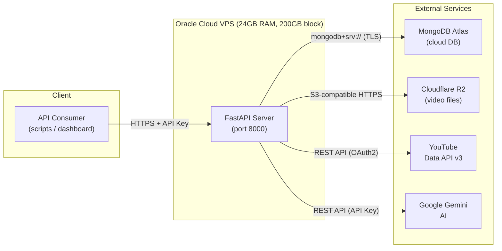
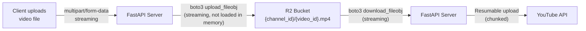
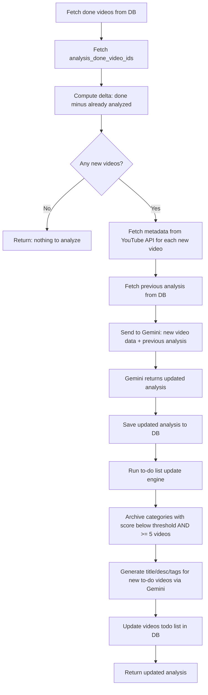

# YouTube Automation Server

## Tech Stack

- **Runtime**: Python 3.11+
- **Framework**: FastAPI (async, streaming uploads, auto-generated OpenAPI docs)
- **Database**: MongoDB Atlas via `motor` (async driver)
- **Object Storage**: Cloudflare R2 via `boto3` (S3-compatible)
- **AI**: Google Gemini via `google-genai`
- **YouTube**: YouTube Data API v3 via `google-api-python-client` + `google-auth`
- **Auth**: API key in `X-API-Key` header (validated via FastAPI dependency)
- **Config**: `.env` file via `pydantic-settings`

---

## Integration Architecture

### How Server, Database, and Object Storage Connect



### Oracle Cloud VPS (Server)

The FastAPI application runs on the Oracle VPS. This is the only component you directly manage.

- **What lives here**: The Python FastAPI process, `.env` config file, YouTube OAuth token file
- **What does NOT live here**: No video files stored on disk long-term (streamed through to R2), no database (lives in Atlas)
- **Block storage (200GB)**: Used only for OS, Python environment, and temporary file buffering during video upload/download streams
- **Networking**: The VPS makes outbound HTTPS connections to all three external services -- no inbound connections needed from them
- **Setup**: Install Python 3.11+, clone the repo, `pip install -r requirements.txt`, configure `.env`, run with `uvicorn` behind a reverse proxy (Caddy or Nginx) for TLS termination
- **Process management**: Use `systemd` to keep the FastAPI server running, auto-restart on crash

### MongoDB Atlas (Database)

All structured data lives in Atlas. The server connects via a connection string.

- **Connection**: `motor.motor_asyncio.AsyncIOMotorClient(MONGODB_URI)` -- uses the `mongodb+srv://` connection string from Atlas dashboard
- **Network access**: In Atlas, whitelist the Oracle VPS's public IP (or use `0.0.0.0/0` during dev) under Network Access
- **Auth**: Username/password embedded in the connection string, TLS is enforced by default
- **What's stored**: Channel metadata, video records (metadata only, not files), posting queue, analysis results, categories
- **What's NOT stored**: Actual video files (those go to R2), temporary processing data
- **Connection lifecycle**: Motor client is created once at app startup (in FastAPI's `lifespan` event) and reused for all requests -- no per-request connection overhead

**Startup flow in `database.py**`:

```python
from motor.motor_asyncio import AsyncIOMotorClient

client: AsyncIOMotorClient = None

async def connect_db(mongodb_uri: str, db_name: str):
    global client
    client = AsyncIOMotorClient(mongodb_uri)
    db = client[db_name]
    # Create indexes
    await db.videos.create_index([("channel_id", 1), ("status", 1)])
    await db.videos.create_index("video_id", unique=True)
    await db.video_queue.create_index([("channel_id", 1), ("position", 1)])
    await db.categories.create_index([("channel_id", 1), ("status", 1), ("score", -1)])
    await db.analysis.create_index("channel_id", unique=True)
    return db

async def close_db():
    global client
    if client:
        client.close()
```

### Cloudflare R2 (Object Storage)

Video files (up to 1GB) are stored in R2. The server never stores video files on its own disk permanently -- it streams them through.

- **Connection**: `boto3` client configured with R2's S3-compatible endpoint, access key, and secret key
- **Endpoint**: `https://<account_id>.r2.cloudflarestorage.com`
- **Auth**: R2 API token (access key ID + secret access key) created in Cloudflare dashboard
- **Bucket structure**: One bucket, objects keyed as `{channel_id}/{video_id}.mp4`
- **No egress fees**: R2 has zero egress cost, which matters since videos are downloaded back to the server before YouTube upload

**How video files flow**:



- **Upload path**: When a video is added to the posting queue, the client sends the file via multipart upload. FastAPI receives it as a `SpooledTemporaryFile` (stays in memory up to 1MB, spills to disk after). The server streams it directly to R2 using `upload_fileobj` -- the full 1GB file is never held in memory at once.
- **Download path**: When `upload-all` is triggered, the server streams each video from R2 to a temporary file, then does a YouTube resumable upload from that temp file. The temp file is deleted after upload completes.

**R2 client setup in `r2.py**`:

```python
import boto3

def get_r2_client(endpoint_url, access_key_id, secret_access_key):
    return boto3.client(
        "s3",
        endpoint_url=endpoint_url,
        aws_access_key_id=access_key_id,
        aws_secret_access_key=secret_access_key,
        region_name="auto",
    )
```

### How They All Work Together (End-to-End Example)

**Example: "Add video to queue and later upload to YouTube"**

1. Client calls `POST /api/v1/channels/ch1/videos/queue` with video file + metadata
2. Server creates a video record in **MongoDB** (`videos` collection, status=todo) and a queue entry (`video_queue` collection)
3. Server streams the video file to **R2** at key `ch1/{video_id}.mp4`, stores the `r2_object_key` in the MongoDB video record
4. Later, client calls `POST /api/v1/channels/ch1/posting/upload-all`
5. Server reads the queue from **MongoDB**, iterates in order
6. For each queued video: streams the file from **R2** -> uploads to **YouTube** via resumable upload -> saves `youtube_video_id` back to **MongoDB** -> deletes from queue in **MongoDB**

**Example: "Run analysis update"**

1. Client calls `POST /api/v1/channels/ch1/analysis/update`
2. Server reads done videos from **MongoDB**, compares with already-analyzed IDs
3. For new videos that have a `youtube_video_id`, server fetches view/engagement stats from **YouTube API**
4. Server sends video metadata + stats + previous analysis to **Gemini**
5. Gemini returns updated analysis JSON
6. Server writes updated analysis back to **MongoDB**
7. Server runs to-do engine: reads categories from **MongoDB**, archives underperformers, generates new to-do video content via **Gemini**, writes new to-do videos to **MongoDB**

### Security and Network Summary

- **Oracle VPS -> MongoDB Atlas**: Outbound TLS on port 27017. Atlas IP whitelist must include VPS public IP.
- **Oracle VPS -> Cloudflare R2**: Outbound HTTPS on port 443. Auth via R2 API token (key pair).
- **Oracle VPS -> YouTube API**: Outbound HTTPS. Auth via OAuth2 (initial browser-based consent, then refreshed automatically via stored token).
- **Oracle VPS -> Gemini API**: Outbound HTTPS. Auth via API key in request header.
- **Client -> Oracle VPS**: Inbound HTTPS (Caddy/Nginx terminates TLS on port 443, proxies to FastAPI on 8000). Auth via `X-API-Key` header.
- **Oracle VPS firewall**: Only port 443 (HTTPS) and 22 (SSH) need to be open inbound. Everything else is outbound-only.

---

## Project Structure

```
server-creation/
  app/
    main.py                  # FastAPI app, lifespan, middleware
    config.py                # Pydantic settings (env vars)
    dependencies.py          # API key auth dependency
    database.py              # Motor client + DB/collection helpers
    models/
      channel.py             # Channel Pydantic model
      video.py               # Video, VideoQueue models
      analysis.py            # Analysis, BestTimeSlot, CategoryAnalysis models
      category.py            # Category model
    routers/
      videos.py              # Video list & queue endpoints
      analysis.py            # Update analysis endpoint
      categories.py          # Category CRUD endpoints
      posting.py             # Upload/post videos endpoint
    services/
      gemini.py              # Gemini AI integration
      youtube.py             # YouTube Data API (fetch stats + upload)
      r2.py                  # Cloudflare R2 upload/download
      analysis_engine.py     # Core analysis logic (orchestrates Gemini)
      todo_engine.py         # To-do list updation logic
  requirements.txt
  .env.example
  README.md
```

---

## Database Schema (MongoDB Atlas)

One database per deployment. Each **channel** is identified by a `channel_id`. Collections are shared across channels, with `channel_id` as a discriminator field.

### Collection: `channels`

```json
{
  "_id": ObjectId,
  "channel_id": "channel_a",
  "name": "Channel A",
  "youtube_channel_id": "UC...",
  "created_at": datetime,
  "updated_at": datetime
}
```

### Collection: `videos`

```json
{
  "_id": ObjectId,
  "channel_id": "channel_a",
  "video_id": "auto-generated-uuid",
  "title": "...",
  "description": "...",
  "tags": ["tag1", "tag2"],
  "category": "category_name",
  "subcategory": "subcategory_name",
  "status": "todo" | "done",
  "suggested": false,
  "basis_factor": "...",
  "youtube_video_id": null,       // set after upload
  "r2_object_key": null,          // set when video file is stored
  "metadata": {
    "views": null,
    "engagement": null,
    "avg_percentage_viewed": null
  },
  "created_at": datetime,
  "updated_at": datetime
}
```

### Collection: `video_queue`

```json
{
  "_id": ObjectId,
  "channel_id": "channel_a",
  "video_id": "ref to videos.video_id",
  "position": 1,                  // ordering in queue
  "added_at": datetime
}
```

### Collection: `analysis`

```json
{
  "_id": ObjectId,
  "channel_id": "channel_a",
  "best_posting_times": [
    {
      "day_of_week": "monday",    // monday-sunday
      "video_count": 1,
      "times": ["10:00", "14:00"]
    }
  ],
  "category_analysis": [
    {
      "category": "tutorials",
      "best_title_patterns": ["..."],
      "best_description_template": "...",
      "best_tags": ["..."],
      "score": 85.5
    }
  ],
  "analysis_done_video_ids": ["video_id_1", "video_id_2"],
  "version": 3,                  // increments on each update
  "created_at": datetime,
  "updated_at": datetime
}
```

### Collection: `categories`

```json
{
  "_id": ObjectId,
  "channel_id": "channel_a",
  "name": "Tutorials",
  "description": "...",
  "raw_description": "...",
  "score": 78.5,
  "status": "active" | "archived",
  "video_count": 12,
  "created_at": datetime,
  "updated_at": datetime
}
```

Indexes:

- `videos`: compound index on `(channel_id, status)`, unique index on `video_id`
- `video_queue`: compound index on `(channel_id, position)`
- `categories`: compound index on `(channel_id, status, score)`
- `analysis`: unique index on `channel_id` (one analysis doc per channel)

---

## API Endpoints

All endpoints are prefixed with `/api/v1` and scoped to a channel via path param `{channel_id}`.

### Videos Router (`/api/v1/channels/{channel_id}/videos`)

| Method | Path                 | Description                                                        |
| ------ | -------------------- | ------------------------------------------------------------------ | --------- | ---------------------------------------------------- |
| GET    | `/`                  | Get video list (query: `status=done                                | todo      | all`, `suggest_n=int` to mark n videos as suggested) |
| PATCH  | `/{video_id}/status` | Mark video done or undone (body: `{"status": "done"                | "todo"}`) |
| POST   | `/queue`             | Add video to posting queue + videos list (body: full video object) |

**GET `/**` detail:

- Returns paginated video list with metadata (title, category, subcategory, basis_factor, status, suggested)
- If `suggest_n` query param is provided (e.g. `?suggest_n=3`), it picks the top `n` from the to-do list (ordered by category score) and marks them as `suggested=true` in DB before returning

### Analysis Router (`/api/v1/channels/{channel_id}/analysis`)

| Method | Path      | Description                                                 |
| ------ | --------- | ----------------------------------------------------------- |
| POST   | `/update` | Run full analysis update (heavy endpoint -- see flow below) |
| GET    | `/latest` | Get latest analysis object                                  |

**POST `/update**` flow:



### Categories Router (`/api/v1/channels/{channel_id}/categories`)

| Method | Path             | Description                                |
| ------ | ---------------- | ------------------------------------------ |
| GET    | `/`              | List all categories (sorted by score desc) |
| POST   | `/`              | Add new category/categories                |
| PATCH  | `/{category_id}` | Update a category                          |

### Posting Router (`/api/v1/channels/{channel_id}/posting`)

| Method | Path          | Description                                    |
| ------ | ------------- | ---------------------------------------------- |
| GET    | `/queue`      | Get current posting queue                      |
| POST   | `/upload-all` | Upload all queued videos to YouTube one by one |

**POST `/upload-all**` flow:

- Iterate through posting queue (ordered by position)
- For each video: download from R2 -> upload to YouTube via API -> update `youtube_video_id` in DB -> remove from queue
- Returns summary of uploaded/failed videos

---

## Services Layer

### `r2.py` -- Cloudflare R2

- Uses `boto3` with R2 endpoint URL
- `upload_video(file_stream, key)` -- streaming upload (handles 1GB files without loading into memory)
- `download_video(key)` -- streaming download
- `delete_video(key)`

### `gemini.py` -- Gemini AI

- `analyze_videos(video_data, previous_analysis)` -- sends structured prompt, returns updated analysis JSON
- `generate_video_content(category, category_analysis)` -- generates title, description, tags for a to-do video

### `youtube.py` -- YouTube API

- `get_video_stats(youtube_video_ids)` -- fetches views, engagement, avg % viewed
- `upload_video(file_stream, title, description, tags, category)` -- resumable upload to YouTube

### `analysis_engine.py` -- Orchestrator

- `run_analysis(channel_id)` -- full analysis flow (the POST `/update` logic)

### `todo_engine.py` -- To-do List Builder

- `update_todo_list(channel_id, analysis)` -- archives bad categories, generates new to-do items

---

## Configuration (`.env.example`)

```
# Server
API_KEY=your-api-key
HOST=0.0.0.0
PORT=8000

# MongoDB
MONGODB_URI=mongodb+srv://...
MONGODB_DB_NAME=youtube_automation

# Cloudflare R2
R2_ACCOUNT_ID=...
R2_ACCESS_KEY_ID=...
R2_SECRET_ACCESS_KEY=...
R2_BUCKET_NAME=...
R2_ENDPOINT_URL=https://<account_id>.r2.cloudflarestorage.com

# Gemini
GEMINI_API_KEY=...

# YouTube
YOUTUBE_CLIENT_SECRET_JSON=path/to/client_secret.json
YOUTUBE_TOKEN_JSON=path/to/token.json
```

---

## Implementation Order

The build follows a bottom-up approach: database layer first, then services, then endpoints.
